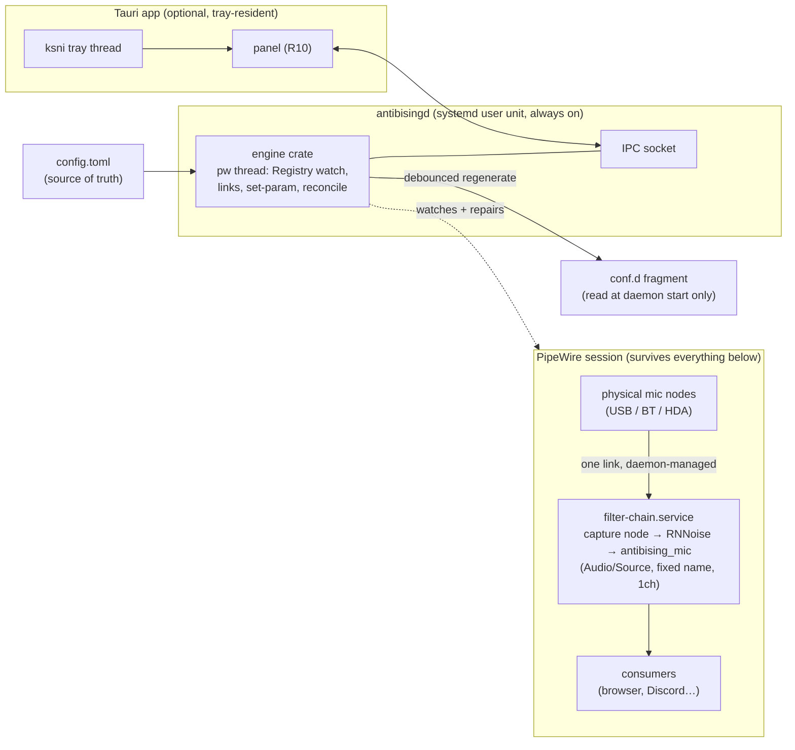

# antibising — the microphone that never disappears

**Date:** 2026-07-27
**Status:** Implementation-ready (Product Contract from brainstorm, enriched by ce-plan on 2026-07-28)
**Seeded from:** `docs/ideation/2026-07-27-noisetorch-tauri-rewrite-ideation.html` (ideas 1 + 2 + 3), then substantially reframed by dialogue.

---

## Goal Capsule

**Objective:** Build antibising v1 on this machine — a permanent, denoising PipeWire microphone source with ranked device routing, live controls, a compact panel, and a tray — to the Definition of Done at the end of this document.

**Authority hierarchy:** Product Contract (R1–R10, scope boundaries) > Planning Contract (KTDs, identity rules) > per-unit notes. If implementation contradicts a KTD, update the plan; if it contradicts the Product Contract, stop and ask.

**Stop conditions:**
- Any test that can disrupt the user's live audio session (PipeWire SIGKILL, daemon restarts, touching the running NoiseTorch filter) requires explicit user consent *per run* — this session destroyed the user's live filter once already.
- Any change that would alter product scope or a closed decision (Q1–Q8) — stop and surface it.
- The stereo-tone downmix acceptance test (U2) failing after reasonable attempts — stop; the channel strategy is a product-level constraint, not an implementation detail to improvise around.

**Execution profile:** verification runs against the live PipeWire session with throwaway sources and synthetic tone fixtures — the method this document's measurements were produced with. No audio mocks. Engine logic that is pure (ranking, identity, state) gets ordinary unit tests.

**Product Contract preservation:** changed in two places, both truthfulness corrections rather than scope changes. (1) The Dependencies footnote ("installs two files") now attributes installation to the product's installer rather than "the app," after planning moved the routing policy into a daemon (KTD7). (2) The secondary success criterion ("a PipeWire restart does not require touching the browser") is re-bounded to what measurement proved achievable: source + routing self-recover unattended; a consumer's dead session cannot be resurrected by anything at this layer — the doc's own "Source recovery is not consumer recovery" finding already established this, and the criterion now matches it. No requirement, scope boundary, or closed question changed. All other R/A/Q content above the Planning Contract is the brainstorm's, as closed during measurement sessions on 2026-07-27.

## The reframe

The ideation doc scoped a *NoiseTorch rewrite*: a better tray app for loading an RNNoise filter. Dialogue moved the target.

> "I just need a stable mic that will always exist, so I don't have to close and reopen my browser whenever I switch mics, or even when there is no mic at all."

**This is not a noise-cancellation app. It is a microphone endpoint with a stable identity — one that denoises.** Both halves are required. The stable identity is what stops the browser-restart ritual; the denoising, with a live-adjustable threshold, is what makes the source worth pointing applications at in the first place. Neither alone is the product.

The distinction from NoiseTorch is still load-bearing, because it inverts the failure model. NoiseTorch's model is *filter a device*; when the device changes, the filter is wrong and must be rebuilt — which is why the recovery ritual (quit NoiseTorch → relaunch → quit browser → relaunch, mid-meeting) exists at all. The model here is *a permanent source, fed by whichever device is currently best*; when the device changes, only the feed changes, and consumers never observe it.

What NoiseTorch got right is kept: a user-controlled noise-suppression threshold, not a fixed preset. What it never had is added: the ability to hear your own filtered microphone before a meeting rather than discovering the problem during one.

### What actually goes wrong today

Observed on this machine, not hypothesized:

- The current filter's `target.object` names `alsa_input.pci-0000_00_1f.3-...HiFi__Mic1__source` — a device that no longer exists.
- WirePlumber silently relinked the filter's capture side to the Razer anyway. Audio flows. **The current setup works by accident, with no policy behind it** — nothing chose the Razer; it was the fallback that happened to be reachable.
- `default.configured.audio.source` is pinned to `"NoiseTorch Microphone for Razer Seiren Mini"` — a node name that no longer exists either.
- The filter runs inside `pipewire-pulse` (PID 2541277) via the PA-compat module layer: **instant, volatile, dies with the daemon.**
- `filter-chain.service` — which ships with `BindsTo=pipewire.service` and `Restart=on-failure` — is `disabled` and `inactive`.

The reason a PipeWire restart kills the mic is that the filter lives in the volatile layer instead of the supported one.

---

## Verified foundation

Every claim below was tested on this machine on 2026-07-27 against an isolated throwaway source (`abtest_source`), then cleaned up. The live filter was never touched.

| Action | Virtual source identity | Consumer handle |
|---|---|---|
| Auto-linked to Razer USB mic | `id=1149 serial=19770` | attached |
| Input swapped → Bluetooth headset | `id=1149 serial=19770` | **held** |
| **All** inputs disconnected | `id=1149 serial=19770`, still `RUNNING` | **held** |

Three consequences:

1. **The source outlives its input.** The `Audio/Source` node (playback side) and the capture stream are separate nodes with separate lifecycles. Only the capture side binds to hardware.
2. **A source with no input is legal.** It stays `RUNNING` and keeps serving consumers. "No mic at all" is a supported state, not an error path.
3. **Retargeting is a link operation, not a rebuild.** Relinking the capture side swaps the physical mic with zero effect on the source's `id`, `serial`, or `node.name`.

Additional verified facts:

- `node.name` is immutable after registration — the permanent source's name must be chosen once, at creation, and never derived from the physical device.
- `pw-metadata <capture-node> target.object '"<name>"'` is accepted but **does not** move an already-linked stream. Retargeting requires acting on the link itself. *(This is the single most important implementation constraint discovered; it invalidates the obvious "just set the metadata" approach.)*
- `~/.config/pipewire/filter-chain.conf.d/*.conf` fragments are read by `pipewire -c filter-chain.conf` at **daemon start only**. There is no reload command.
- The shipped `source-rnnoise.conf` is a *fragment*, not a standalone config — running it directly fails with `can't find protocol 'PipeWire:Protocol:Native'`. It is only valid as a conf.d drop-in.
- `/usr/lib/ladspa/librnnoise_ladspa.so` is present system-wide; RNNoise is available as a system package on this distro.
- **RNNoise exposes three controls, not one:** `VAD Threshold (%)`, `VAD Grace Period (ms)`, and `Retroactive VAD Grace (ms)`. NoiseTorch surfaced only the first.
- **Filter parameters are live-adjustable without rebuilding the source.** `pw-cli set-param <node-id> Props '{ params = [ "rnnoise:VAD Threshold (%)" 95.0 ] }'` was accepted and read back as `Int 95` while the source stayed `RUNNING` with unchanged identity. Two traps, both hit and diagnosed this session: **(a)** the key must be prefixed with the **filter-graph node name** (`rnnoise` in the shipped preset), not the plugin filename or LADSPA label — a wrong prefix is accepted silently and does nothing; **(b)** the call must target the **capture node** (`node.name` of the input half), not the `Audio/Source` node — targeting the source half is likewise accepted and silently ignored.
- **Monitoring needs no extra module.** Linking the permanent source's output ports directly to a sink's playback ports (`pw-link abtest_source:capture_FL <sink>:playback_FL`) routes filtered audio to the speakers immediately, and unlinking removes it. Source identity was unaffected by both operations.
- **No peak/level metering is exposed on the node.** `Props` carries no `peak`/`level`/`meter` field, so a Discord-style level meter must compute levels from a real audio stream the app captures itself, not from a cheap property read.
- **Consumer identity is fully introspectable.** `pactl list source-outputs` gives `application.name`, `application.process.binary`, the `Source:` id each is attached to, and a `Corked` flag (`no` = actively capturing, `yes` = holding a handle while idle). Not used in v1 — R10 has no consumer indicator — but it is the mechanism if that display is ever wanted.
- **Everything runs unprivileged.** Every operation in this document was performed as uid 1000. No root, no `sudo`, no capabilities. The PipeWire sockets are user-owned (`srw-rw-rw- ivan ivan`), the config directory is `~/.config/pipewire/`, and `filter-chain.service` is a **user** unit under `/usr/lib/systemd/user/`.
- **NoiseTorch's `cap_sys_resource=eip` is not needed.** The installed binary carries that capability (`getcap ~/.local/bin/noisetorch`), which is why its installer requests elevation. It is a PulseAudio-era artifact for raising memlock limits. PipeWire obtains realtime scheduling through `rtkit-daemon` (active on this machine) via D-Bus, so an unprivileged process gets RT priority without any capability. Confirmed: the user's `ulimit -l` is 8192 and PipeWire logs zero mlock/rlimit complaints.
- **The NPU exists and is idle.** `/dev/accel/accel0` is present with the `intel_vpu` module loaded (refcount 0 — nothing is using it) and the device is world-accessible (`crw-rw-rw-`). Relevant to the acceleration question below; not usable for this workload.
- **`filter-chain.service` starts on demand, no logout required.** Writing a conf.d fragment and running `systemctl --user start filter-chain.service` produced a live source in ~3 seconds, repeatedly. The unit ships with PipeWire at `/usr/lib/systemd/user/filter-chain.service` and is `disabled` by default.
- **Runtime `set-param` values do not survive a service restart.** Set to 95, restarted, read back 50 — the conf.d value. The fragment is the only durable store; there is no write-back path from runtime to disk.
- **`object.serial` changes on every restart; `node.name` does not.** Observed 19949 → 19984 → 20020 → 20183 across four restarts of the same unit, with `node.name` constant throughout. Any persistent reference — the app's own or a consumer's — must key on the name.
- **Consumers do not uniformly survive a restart of the source.** A consumer with an explicit target reattached to the new serial; one without an explicit target fell back to a different microphone and never returned. See open question 8.
- **The shipped `filter-chain.service` does not survive a PipeWire crash.** `BindsTo=pipewire.service` issues a clean stop when PipeWire dies, so `Restart=on-failure` does not fire and the already-active `default.target` does not re-pull the unit. A graceful `restart` of `pipewire.service` recovers; a `SIGKILL` does not. Fixed and verified with an `Upholds=filter-chain.service` drop-in on `pipewire.service` (systemd ≥ 249), which recovered the source across two consecutive kills.
- **NoiseTorch's PA-compat filter does not auto-recover from a PipeWire crash; manual repair works, but only through the GUI.** Confirmed destructively: the user's live filtered source was destroyed by the `SIGKILL` test and did not return on its own. CLI reload failed repeatedly (`PulseAudio source not found`, then intermittent `Couldn't fetch sources from pulseaudio` against a freshly restarted daemon, while `pactl` itself saw all nine sources). A **GUI relaunch plus "Load NoiseTorch" restored it** — confirmed by the user. So the defect is precisely the absence of *automatic* recovery, plus a repair path that requires a human at a window. That is the whole product thesis in one incident.
- **Source recovery is not consumer recovery.** With the `Upholds=` fix in place, the source returned after a crash but an attached consumer did not reattach to it. Nothing at the systemd layer can fix that; it argues for never restarting during normal operation.
- **A 2ch device links to a `[ MONO ]` capture port, and the mix is a SUM, not an average.** Proven with channel-distinct tones through a synthetic 2ch source, not ambient audio. Left-only and right-only each produced RMS 8484 at the mono output; both-channels produced **16968 — exactly 2×**. Both channels contribute, at unity gain each. **This clips:** a 2ch tone at 0.92 FS per channel drove the mono output to peak 32768 with **63.2% of samples clipped**. The capture side must therefore declare explicit per-channel gain (0.5) or an averaging mix — the adapter's default is not safe for stereo input. See Q1.
- **Bluetooth device identity is stable across profile changes; the churn is on nodes the app must ignore.** `bluez_input.<MAC>` (class `Audio/Source`) held `id=129 serial=178` across a full A2DP → HSP/HFP → A2DP round trip. A *separate* node, `bluez_input.<MAC_underscored>.0` (class `Audio/Source/Internal`), is created and destroyed by the switch. **Device enumeration must exclude any `media.class` ending in `/Internal`** or the app sees phantom arrivals and departures.
- **Opening a Bluetooth source pulls the card into the mic-capable profile automatically.** With the card in `a2dp-sink`, starting a capture on the stable source flipped it to `headset-head-unit` for the duration and restored `a2dp-sink` on close. The app never needs to manage BT profiles — attaching the capture side is the profile switch.

## The denoiser: decided — RNNoise

Surveyed because the user asked whether werman's plugin is the only choice, and whether anything can use the GPU. Package facts below were checked against this machine's package database; upstream dates come from repository history.

| Option | State in 2026 | Format | Tunable | Verdict |
|---|---|---|---|---|
| **werman/noise-suppression-for-voice** (in use) | `noise-suppression-for-voice 1.21-1`, Arch **Extra**, installed | LADSPA, LV2, VST3 | `VAD Threshold (%)` + 2 grace periods | Packaged, maintained, already working. ~10 ms latency. |
| **DeepFilterNet** | Last tagged release Aug 2023; community activity continues. AUR only — `libdeep_filter_ladspa-bin` (2023) and `-git` (May 2025) | LADSPA | `Attenuation Limit (dB)` | Better on non-stationary noise (keyboards, background speech). 20 ms latency. |
| **xiph/rnnoise** | v0.2 (Apr 2024), commits into 2025. Installed as `rnnoise 1:0.2-1` | library only | none | Engine beneath werman's wrapper. Direct use only if writing your own plugin. |
| **nnnoiseless** | Rust RNNoise port, v0.5.2 (Dec 2025) | Rust crate | none ("knobless") | Attractive for a Rust app, but **has no parameters** — incompatible with R8. |
| **speexdsp** | v1.2.1 (2022), installed | library only | dB attenuation, VAD, AGC | Pre-RNNoise generation. Fallback only. |
| **WebRTC APM** | Ships with PipeWire (`libpipewire-module-echo-cancel`) | PipeWire module | AEC/AGC/NS pipeline | Relevant only if echo cancellation is wanted later. |
| **NVIDIA RTX Voice / Maxine** | Windows + NVIDIA RTX only | — | — | Not applicable. No NVIDIA GPU on this machine. |

**Answer to "is werman the only one?"** No. It is the only one simultaneously packaged in Arch Extra, actively maintained, and exposing real-time parameters — but DeepFilterNet is a serious alternative and a genuine quality upgrade, at the cost of an AUR build and a stalled release cadence. `nnnoiseless` is disqualified by R8 alone: a knobless denoiser cannot satisfy a requirement whose entire point is a user-controlled strength.

**Decision: RNNoise ships in v1.** The user's call, on the grounds that NoiseTorch already proved it on this machine. It is installed, packaged in Arch Extra, half the latency, and needs no build step. R6 (denoising is a property of the source, not its identity) and R8 (one primary strength control, engine-specific) were both written to survive an engine swap, so moving to DeepFilterNet later costs an AUR build and a label change — not a redesign.

Worth recording why the swap is not free: the two engines' controls are **not interchangeable** — verified from DeepFilterNet's own filter-chain config, its knob is `"Attenuation Limit (dB)" 100`, which asks *"how much noise may I remove at most,"* where RNNoise's `VAD Threshold (%)` asks *"how confident must I be that this is speech."* Different question, different slider semantics, which is why R8 refuses a generic "strength" abstraction.

The tradeoff being knowingly accepted: **DeepFilterNet is materially better at exactly the keyboard-clatter case named in this document's second success test**, at the cost of an AUR build and 20 ms algorithmic latency instead of 10 ms. If RNNoise's keyboard handling proves insufficient in practice, that is the trigger to revisit — not a reason to delay v1.

**Answer to "can it use the GPU?"** No, and it should not want to.

- DeepFilterNet's LADSPA plugin runs `libDF`, a Rust-native SIMD CPU path. It has **no GPU code path at all** — `tract` (used only for output-parity checking) supports CPU, Apple Metal, and CUDA; there is no Intel iGPU or NPU backend.
- The Intel NPU is real and idle on this machine (`/dev/accel/accel0`, driver v1.35.0 supports Meteor Lake), and ONNX Runtime's OpenVINO EP can technically target `device_type: "NPU"`. But OpenVINO's NPU-validated model list is entirely vision models — **no speech model appears on it**, and no published benchmark of speech enhancement on Intel NPU under Linux exists.
- The arithmetic kills it regardless. DeepFilterNet's RTF is 0.11 on a single mobile i5 thread — roughly **1.1 ms of compute per 10 ms frame**. Dispatch to an iGPU or NPU costs tens to hundreds of microseconds in transfer, kernel launch, and synchronization. For a model this small, the overhead is a significant fraction of, or exceeds, the compute it replaces. GPU offload would raise latency, not lower it.

GPU acceleration pays off for many simultaneous streams, much larger models, or offline batch work. This app is one stream, a ~1M-parameter model, and hard real-time. **Stay on the CPU.**

### Privilege model — the answer is yes, pure userspace

Every operation this app needs was performed in this session as an unprivileged user. No root, no `sudo`, no setcap, no group membership beyond the session's own.

The one contrary data point is explained: the installed NoiseTorch binary carries `cap_sys_resource=eip`, which is why its installer asks for elevation. That capability raises memlock limits — a PulseAudio-era concern. PipeWire instead acquires realtime scheduling through `rtkit-daemon` over D-Bus, which grants RT priority to unprivileged processes by design. `rtkit-daemon` is active on this machine, PipeWire logs no mlock or rlimit complaints, and the user's `ulimit -l` is a stock 8192.

Everything the app touches is user-owned: the PipeWire sockets in `/run/user/1000/`, config under `~/.config/pipewire/`, and `filter-chain.service` as a systemd **user** unit. The one caveat is installing a *different* denoiser system-wide — `pacman -S` or an AUR build needs root, but that is package installation, not the app running.

---

## Product Contract

### Problem

Switching microphones, or losing one, forces a manual recovery ritual — restart the filter app, then restart every application holding the mic — because the endpoint applications grabbed is bound to a specific physical device. The cost is concentrated exactly when it is least affordable: five minutes before a meeting.

### Users

Primary and only committed user: the author, on Arch + sway/Wayland + waybar, with a Razer Seiren Mini, a Bluetooth headset, and a laptop internal mic.

**Scope decision — "my machine, built to survive me."** Ship for this setup, but hold two lines: no hardcoded device names or IDs anywhere, and nothing that assumes Arch-specific paths or an Arch-specific package set. Packaging, multi-distro support, and a distributable binary are explicitly out of v1.

### Success

A single test, run at any time without preparation:

> With a meeting open and the browser holding the microphone: unplug the USB mic, plug in the headset, unplug that too, plug the USB mic back in. **The browser is never touched and never loses its microphone.**

Secondary, bounded by measurement: after a PipeWire restart or crash, the source and its routing recover **with no action in this product** — but the browser may need to re-acquire its microphone. Measured this session: even with the source back automatically, a consumer attached across a PipeWire crash did not reattach, and nothing at the systemd layer can fix that (see "Source recovery is not consumer recovery"). The recovery this product owes is: source present, correct device feeding it, within seconds, unattended. What it cannot promise is resurrecting another application's dead PipeWire session — no mechanism for that exists on this stack.

Second test, for the half the first one doesn't cover:

> Before a meeting, open the app, hear your own voice, and move the noise threshold until the keyboard clatter drops out — all while the browser is already holding the microphone, and without it noticing anything happened.

### Requirements

**R1 — The permanent source.**
A single `Audio/Source` with a fixed, device-independent name exists whenever the user session is up. It never changes identity. It exists before any microphone is connected, while microphones are being swapped, and after the last one is removed. Its lifetime is the session's, not any device's.

**Channel width is fixed at 1ch, with an explicit downmix gain.** Voice is mono and RNNoise's mono label is half the CPU of stereo. A stereo device links to the mono capture port and both channels contribute — but the adapter's default mix is a **sum at unity gain per channel**, which clips ordinary stereo input (measured: 63.2% of samples clipped at 0.92 FS input). The capture side must therefore state its downmix explicitly — 0.5 per channel, or an averaging mix. See Q1.

**R2 — Survives a PipeWire restart, and avoids causing one.**
R1 holds across a PipeWire restart or crash without user action. This rules out the volatile PA-compat module path currently in use — **demonstrated this session, destructively: a `SIGKILL` of `pipewire.service` destroyed the user's live NoiseTorch filter, and it did not return on its own.** Restoring it took a manual GUI reload. That is the exact failure this requirement exists to forbid.

**The shipped unit does not satisfy this requirement on its own.** `/usr/lib/systemd/user/filter-chain.service` declares `BindsTo=pipewire.service` with `Restart=on-failure` and `WantedBy=default.target`. When PipeWire dies, `BindsTo` issues a *clean stop* — journal reads `Stopping PipeWire filter chain daemon... / Stopped` — so `Restart=on-failure` never fires, and `default.target` is already active so nothing re-pulls the unit. Measured: a graceful `systemctl --user restart pipewire.service` recovers, but a `SIGKILL` leaves `filter-chain: inactive` and the source gone.

**Verified fix:** a drop-in adding `Upholds=filter-chain.service` to `pipewire.service` (systemd ≥ 249; 261 here). Systemd then continuously re-pulls the unit instead of waiting for a target activation. Tested across two consecutive `SIGKILL`s — `filter-chain: active` and the source present within seconds, both times. **Installing this drop-in is part of the app's setup, not an optional extra.**

The stronger half, discovered by measurement: **the app must never restart the source during normal operation.** A restart changes `object.serial` and drops consumers — one test consumer fell back to a different microphone and never returned (open question 8). Even with the `Upholds=` fix, a consumer attached across a PipeWire crash did **not** reattach when the source returned: recovery restores the source, not the sessions using it. Every routine action — changing threshold, switching input, toggling denoise — must be a live operation on the running graph. Restarting is a repair path, not a control path.

**R3 — Ranked routing with sticky override.**
The user maintains an ordered mic preference list. On any device arrival or departure, the highest-ranked present device feeds the permanent source. A manual selection in the UI **pins** that device and suppresses ranking until the user unpins it or the pinned device disappears — on disappearance, the pin is released and ranking resumes. Ranking must be expressed against stable device identity, never `node.name`.

**Enumeration rule, verified:** rank and pin against `Audio/Source` nodes only. Any node whose `media.class` ends in `/Internal` is an implementation detail — Bluetooth profile switches create and destroy one on every transition, and treating it as a device produces phantom arrivals and departures that would thrash the ranking. The stable `bluez_input.<MAC>` node holds its identity across those switches (Q2), so the pin survives a headset moving between A2DP and HSP/HFP with no special handling. The app never sets a Bluetooth profile itself: opening the source pulls the card into the mic-capable profile automatically, and closing it restores the prior one.

**R4 — Silence is a legal state.**
With no microphone present, the source persists and consumers keep their handles. The UI must show this state distinctly and honestly — it is not an error and must not be reported as one.

**R5 — Honest status.**
The UI never claims audio is flowing without verifying the capture side is actually linked to a live device. The current setup reports `RUNNING` while pointed at a device that has not existed for days; that specific lie is what this requirement exists to prevent.

**R6 — Denoising is a property of the source, not its identity.**
Toggling noise suppression, or changing any of its parameters, must not destroy or recreate the permanent source. R1 outranks the filter. *Verified feasible:* `set-param` changed the VAD threshold live with the source's `id`/`serial` unchanged.

**R7 — Recovery without ritual.**
Any state the app can detect, it must repair itself. Where repair is impossible, it must say precisely what is wrong. No path through the UI should ever require restarting a consumer application.

**R8 — Live denoising controls.**
Noise suppression strength is user-adjustable at runtime, taking effect without an audio dropout and without a rebuild of the source. The UI exposes **one primary strength control, prominently** — this is the NoiseTorch behavior the user explicitly wants kept. In v1 that control is RNNoise's `VAD Threshold (%)` (Q7). Secondary parameters (RNNoise's two grace periods) are available but need not share that prominence. Adjusting any of them is subject to R6 — identity survives.

The control's *meaning* is engine-specific and the UI must not pretend otherwise: a VAD threshold asks "how confident must I be that this is speech." Should the engine ever change, the label and its direction follow the active denoiser rather than a generic "strength" abstraction — DeepFilterNet's `Attenuation Limit (dB)` asks the opposite question ("how much noise may I remove at most") and would need its own label, not a renamed slider.

**Persistence is two-layer, and the app's config is the source of truth.** Verified: a live `set-param` value does not survive a service restart — set to 95, restarted, read back the conf.d value of 50. So a slider move does two things: `set-param` immediately for audible effect, and a debounced write to the conf.d fragment so the *next* session is born correct. The fragment write must never trigger a restart to take effect (R2).

**R9 — Test and monitor.**
The user can hear their own filtered microphone on demand, as in Discord's mic test. Monitoring is explicitly temporary and self-terminating: it must never survive app exit, and it must not be possible to leave it on by accident. Alongside audible monitoring, a live input-level indicator shows that audio is actually arriving — this is what makes R5's honesty claim checkable by ear and eye rather than asserted.

Monitoring must degrade sanely: when no microphone is present (R4), monitoring reports silence rather than failing, and feedback risk is the user's to manage — the app warns when the monitor output is a speaker rather than a headset, but does not refuse.

**Destination is the current default sink, decided (Q6).** Monitoring routes to whatever sink is default at the moment it starts; there is no separate picker. A destination selector on a momentary diagnostic is a settings page nobody wants. Monitoring does not follow a default-sink change mid-session — stopping and restarting it re-resolves the destination, which is acceptable for something explicitly temporary.

**R10 — The panel says what is true, at a glance.**
The main surface is a single compact panel. Three controls, one indicator:

- **A denoise toggle** — on/off for suppression only. Per R6 it never destroys the source, so toggling it is safe mid-meeting. Off means clean passthrough, not "microphone gone."
- **The input dropdown** — which physical mic currently feeds the source. Selecting a device here is the sticky pin of R3. The list includes an explicit **"Auto (ranked)"** entry, which is the unpinned ranked-routing mode — the highest-ranked present device, per R3's own preference list, not the OS/PipeWire default source. Calling it "system default" would misname the mechanism, since it has nothing to do with `pactl get-default-source`; the distinction from a pinned device must still be visible, because the two behave differently when hardware changes.
- **The monitor button** — starts and stops R9's hear-yourself monitoring. It must show its active state unambiguously (monitoring on is exactly the state R9 forbids leaving on by accident), and it is where the R9 speaker warning surfaces — as a non-blocking inline notice when monitoring starts toward a speaker, never a dialog that gates the feature.
- **The speech indicator** — visible motion when the user talks, driven by the R9 level meter. This is the fastest honest answer to "is this thing working," and it is the only element that must animate.

Plus the R8 strength control. Nothing in the panel may report a state the app has not verified (R5).

### Non-requirements (v1)

- Packaging, installers, distro support beyond this machine.
- Per-application filtering or routing.
- Output/sink processing — microphones only.
- Multiple simultaneous virtual sources.
- More than one denoiser available at once, or switchable at runtime. v1 ships RNNoise only (Q7); R6 and R8 keep a later swap cheap.
- Recording, saving, or exporting the monitor stream. R9 is hear-it-now only.
- A spectrum analyzer or waveform display. R9's meter is a level indicator, not visualization.
- A speaker/output side. Krisp's panel has a second "Krisp Speaker" row; this app is microphones only.

### Outside this product's identity

- **Not a mixer or patchbay.** It owns one source and its feed. Anything wanting arbitrary graph editing is Helvum's job.
- **Not a NoiseTorch clone.** NoiseTorch's device-bound model is the defect being corrected, not a design to reimplement more tidily.
- **Not a PipeWire configuration front-end.** It manages one virtual source, not the user's audio stack.

### Dependencies

- PipeWire ≥ 1.6.8 with `filter-chain` and the `Audio/Source` node type.
- A session manager honoring link policy (WirePlumber 0.5.15 here).
- The RNNoise LADSPA plugin — `librnnoise_ladspa.so`, from `noise-suppression-for-voice` (Arch Extra, installed). Decided in Q7.
- systemd user session — the persistence mechanism in R2 is a user unit.
- **systemd ≥ 249**, for the `Upholds=` drop-in R2 requires. 261 here. On older systemd, R2's crash-recovery half has no verified mechanism.

The product installs two files that touch the user's audio stack: a conf.d fragment defining the source, and a one-line `pipewire.service` drop-in supplying `Upholds=`. Both are user-scoped (`~/.config/`), both are removable, and the second is what makes R2 true — this is the only place the product touches the user's audio stack configuration, a deliberate and narrow exception to "not a PipeWire configuration front-end." (Its own service unit, `antibisingd.service`, is the product's own infrastructure, not audio-stack configuration — see the Planning Contract.)

### Device identity — the rule

Every microphone on this machine carries a bus-native immutable key, exposed on the **device** object (not the node). There is no single universal property — the rule is per-bus:

| Bus | Identity key | Example | Volatile? |
|---|---|---|---|
| USB | `device.serial` — burned into the device | `Razer_Inc_Razer_Seiren_Mini_UC2130L03207565` | No. Survives replug and port change. |
| Bluetooth | MAC address | `74:45:CE:F9:27:D5` | No. |
| Internal (PCI/HDA) | PCI address | `pci-0000_00_1f.3-platform-skl_hda_dsp_generic` | No. Soldered to the board. |

**Two different rules, and conflating them is a bug.**

*For ranking physical mics (R3):* the **saved preference** keys on the **device object's** `device.name` — `alsa_card.usb-Razer_Inc_..._UC2130L03207565-00`, `bluez_card.74_45_CE_F9_27_D5` — the bus-native immutable identity. At link time, resolve device → its current `Audio/Source` node, **excluding any `media.class` ending in `/Internal`** (Q2), and act on that node. Never persist a node name, node `id`, or `object.serial`. The node-name hazard is real on ALSA — the Razer's source carries a profile suffix (`.mono-fallback`) that changes when the card profile changes. Bluetooth turned out gentler than assumed: the measured Q2 round trip showed the stable `bluez_input.<MAC>` node holds `id`, `serial`, and name across A2DP↔HFP — the churn is confined to `/Internal` nodes. The two-step rule (durable device key, resolved to the current non-Internal source node) stands regardless, because it is immune to both the ALSA suffix problem and any stack that does recycle BT nodes.

*For our own permanent source:* key on its `node.name`, which we choose and which is immutable after registration. Never on `object.serial` or node `id` — both change on every daemon restart (observed 19949 → 19984 → 20020 → 20183).

`device.bus-path` (`pci-0000:00:14.0-usb-0:3.3.2:1.0`) must never be part of any identity key: it encodes the physical port and moves when the user replugs into a different socket. The user's Logitech G435 headset and Fantech webcam both carry USB serials too, so the rule covers every device present, not just the three in the success test.

### Assumptions

- **A1.** The user session manager will not fight an explicitly established link. *Partially verified:* manual `pw-link` held for the duration of the test. Not verified across a suspend/resume cycle.
- **A2.** Stable device identity is derivable for the user's three mics from properties that survive replug. **Verified by inspection** — every mic carries a bus-native immutable key on its device object (see "Device identity" above). The Bluetooth profile-switch case is now **measured** (Q2): the stable source node held identity across A2DP↔HFP, so the risk is narrower than assumed. Still unverified across an actual physical replug.
- **A3.** ~~The permanent source's channel layout can be fixed independent of whatever feeds it.~~ **Verified by measurement (Q1).** A 1ch-declared filter accepted a 2ch device — the adapter renegotiated ports and downmixed. The surviving obligation is the explicit downmix gain: the default mix is a unity-gain sum, which clips (63.2% of samples at 0.92 FS input).
- **A4.** Live `set-param` changes are audibly clean — no click, dropout, or glitch as the threshold moves. *Partially verified:* the call was accepted and the source's identity and `RUNNING` state survived, but nothing was listening. R8 claims "without an audio dropout"; that half is untested.
- **A5.** A level meter can be computed from a captured stream at UI frame rates without meaningful CPU cost or disturbing the consumers already attached to the source. *Unverified.* Since no `peak` property exists, R9's meter requires capturing audio — an extra reader on the source. Planning places that reader in the daemon's engine (a metered session that exists only while a client subscribes, per U6), so the UI never opens its own PipeWire connection.

### Open questions

1. ~~**Channel-count mismatch.**~~ **CLOSED — but not the way the first test suggested. The design is fixed-mono with an explicit downmix gain.**

   My first attempt compared ambient RMS from the 2ch Mic1 against ambient RMS from a bypass filter and called it "transparent." That was not a valid proof: two room recordings minutes apart, with correlated channels, cannot show that both channels contribute or that the mix is unity. Redone with **deterministic channel-distinct tones** through a synthetic 2ch null sink:

   | Input (440 Hz, 12000 per-channel peak) | Mono output RMS |
   |---|---|
   | Left channel only | 8484 |
   | Right channel only | 8484 |
   | **Both channels** | **16968 — exactly 2×** |

   So: a 2ch device does link to a capture side declaring `audio.position = [ MONO ]`, both channels do contribute, and **the mix is a SUM at unity gain per channel, not an average.** That is a real hazard, not a curiosity — a 2ch tone at 0.92 FS per channel drove the mono output to peak 32768 with **63.2% of samples clipped**. Stereo input at ordinary levels will clip the permanent source.

   **Decision: the source is fixed 1ch, and the capture side must specify its downmix explicitly** — per-channel gain of 0.5, or an averaging mix — never the adapter's default. Voice is mono and RNNoise's mono label is half the CPU of stereo, so 1ch remains right; "the adapter handles every input width for free" was wrong and is retracted. The plumbing question is settled; the gain is now a stated implementation requirement.

   *Separate caveat, still carried into the denoiser work:* with RNNoise in the graph an ambient input measured RMS 1.8, and 4.5 with `VAD Threshold` at 0 — roughly 44 dB below bypass. In a quiet room that is plausibly correct gating, but it was **not** verified against speech, so it is evidence of nothing either way. A speech-present A/B is a v1 test.
2. ~~**Bluetooth profile switching.**~~ **CLOSED by measurement — it does not fight the pin, because on this stack the profile follows the pin.** Tested by driving `pactl set-card-profile` on the ATH-M20xBT across `a2dp-sink` ↔ `headset-head-unit` while watching `pw-dump -m`.

   The finding that settles it: **the BT source node's identity is stable across profile changes.** `bluez_input.74:45:CE:F9:27:D5` held `id=129 serial=178` through a full A2DP → HSP → A2DP round trip. What churns is a *different*, internal node (`bluez_input.74_45_CE_F9_27_D5.0`, class `Audio/Source/Internal`) plus the sink — neither of which the app ever targets. There is no departure/arrival pair on the node the ranking operates on, so R3's sticky pin is never disturbed.

   Better still, the causality runs the *other* way: **opening the stable source pulls the card into the mic-capable profile automatically.** With the card in `a2dp-sink`, starting a capture flipped it to `headset-head-unit` for the duration and returned it to `a2dp-sink` on close. So "pin the headset" needs no profile management from the app at all — attaching the capture side is the profile switch.

   Consequence for R3: **rank and pin against the stable `Audio/Source` node only.** Nodes whose `media.class` ends in `/Internal` are implementation detail and must be filtered out of device enumeration, or the app will see phantom arrivals and departures on every profile change.
3. ~~**First-run bootstrap.**~~ **CLOSED.** Writing a fragment to `~/.config/pipewire/filter-chain.conf.d/` and running `systemctl --user start filter-chain.service` creates the source in about 3 seconds with **no logout and no full PipeWire restart**. Verified end to end this session. The unit ships with PipeWire, is `disabled` by default, and is a user unit; first run enables and starts it.
4. **Reconciliation on startup.** If a previous instance left a filter running, the app must recognize and adopt it rather than creating a duplicate. **Detection rule now available:** match on `node.name`, which the app itself chose and which is immutable after registration. `systemctl --user is-active filter-chain.service` plus a name lookup distinguishes all four states (no unit / unit running with our source / unit running with a stale source / source present without the unit).
5. ~~**Threshold persistence across restart.**~~ **CLOSED by measurement.** Set live to 95, restarted the service, read back **50** — the conf.d value. Runtime `set-param` is volatile; the fragment is the only durable store. **Therefore: the app's own config is the source of truth.** It applies the value via `set-param` for immediate effect and writes the fragment on a debounce so the *next* daemon start is born correct. This is the same two-layer answer R2 needs, and it is now settled for both.
6. ~~**Monitor output routing.**~~ **CLOSED — the current default sink, always.** User's call. Monitoring follows the default sink and is not separately selectable in v1: it is a momentary "does my mic sound right" check, and a destination picker on a temporary diagnostic is a settings page nobody wants. The feedback risk R9 names does not change this — it is handled by the warning R9 already requires, not by making the user choose a sink. Consequence: the monitor link is created against whatever `pactl get-default-source`'s sink counterpart is *at the moment monitoring starts*, and monitoring does not follow a default-sink change mid-session; stopping and restarting it re-resolves the destination.
7. ~~**Which denoiser ships in v1.**~~ **CLOSED — RNNoise** (`noise-suppression-for-voice` 1.21-1, Arch Extra, installed). User's call: proven in NoiseTorch, already working on this machine, half the latency. R6 and R8 keep a later DeepFilterNet swap cheap; nothing in the design forecloses it.

### Newly discovered — must be in the design

8. **Consumers do NOT reliably follow the source across a filter-chain restart.** Measured this session, and the two behaviors differ sharply:
   - A consumer attached without an explicit target (`pw-cat`) **fell back to the Razer** when the source vanished and **never came back**, even after the source returned.
   - A consumer with an explicit target (`pw-record --target q3_source`) **reattached cleanly** to the new serial.

   The source's `node.name` is stable across restarts but its `object.serial` is not (19949 → 19984 → 20020 → 20183 across four restarts). This is exactly the browser-restart ritual the product exists to abolish — so **R2's real requirement is to avoid restarts, not to survive them.** A parameter change must never restart the service; Q5's `set-param` path is what makes that possible. The fragment rewrite itself is harmless and needs no scheduling: conf.d is read at daemon start only, so writing it is inert until the next natural start. Debounce it whenever convenient. What must never happen is an *explicit* restart to make a setting take effect — that is the disruptive act, not the write.

---

## Planning Contract

**Target repo:** this repository (greenfield — no code exists yet).

### Key Technical Decisions

**KTD1 — Three-artifact Rust workspace: `engine` (library, no UI deps), `antibisingd` (headless daemon), `app` (Tauri v2 client).**
Every audio decision — enumeration, identity, ranking, link management, param control, reconciliation, health — lives in a plain library crate with no Tauri or UI concepts. One shipping consumer in v1: `antibisingd`, a thin binary hosting the engine as a systemd user service. The Tauri app is a client of the daemon over IPC, not a direct consumer of the crate; the engine's test binaries are the second (test-only) consumer. The crate boundary is justified by single-writer enforcement and display-server-free testing, not by consumer count. This extends ideation idea 5 one step: the routing policy can run without a window system.

**KTD7 — The routing policy is a daemon, because R3 is as permanent as R1.**
R1 promises the source exists whenever the session is up; R3 promises arrival/departure routing; the success test unplugs mics mid-meeting with no UI open. A routing policy that lives inside the GUI app makes the product's core promise conditional on a window being open — the exact class of defect (state held hostage by an app's lifetime) this product exists to correct. So `antibisingd` runs as a user unit (`WantedBy=default.target`, `Restart=on-failure`), owns the engine exclusively (single writer — the UI never talks to PipeWire directly), and serves the app over a local IPC socket (Unix domain, JSON messages; exact protocol is implementation detail). UI closed = full routing continues. Daemon down = source persists (KTD4), feed frozen — and systemd restarts it. The app's job shrinks to: render daemon state, send commands, run monitoring/meter sessions.

**KTD2 — Native `pipewire` crate (v0.10.x) on a dedicated thread; no shell-out in steady state.**
Research (librarian, source-verified): the crate is actively maintained (v0.10.0, 2026-05-17); every comparable app — Helvum, Sonusmix, wiremix, coppwr — chose native bindings, none shell out. PipeWire objects are `!Send`, so the engine owns one thread running `MainLoopRc` + `run()`. Commands flow daemon→engine via `pipewire::channel` — its pipe-backed `Receiver` is the attachable path *into* the loop (`Receiver::attach(loop, callback)`), per the crate's own `channel.rs` example. Events flow engine→daemon via plain `std::sync::mpsc`: the pw thread sends without blocking; only *receiving* inside the pw loop is forbidden. Registry `global`/`global_remove` callbacks drive device watching; `Core::create_object::<Link>` / `destroy_object` manage links (factory name discovered at runtime, not hardcoded); `Node::set_param(ParamType::Props, 0, &pod)` sets RNNoise params, with pods built via `spa::pod::object!` + `PodSerializer`. Known escape hatch: if the LADSPA `Props` pod layout resists the macro, `pw-cli set-param` as a child process is an acceptable fallback for that one path — nothing else.
Caution: docs.rs build is broken for 0.10.0 — docs live at `pipewire.pages.freedesktop.org`. `pipewire-sys` must match the system libpipewire (1.6.8 here).

**KTD3 — Tray is ksni, not Tauri's tray; Tauri's tray feature is not compiled in.**
Tauri v2 on Linux still cannot see tray left-clicks (libappindicator has no click path; upstream issue #11293 unresolved as of mid-2026). ksni v0.3.6 restores the full interaction: `activate()` → show window, `menu()` → context menu. No event-loop conflict: ksni is pure zbus/D-Bus and never touches GTK; it runs on its own thread (`blocking` feature) or tokio. `AppHandle` is `Send + Sync` — the activate callback calls `app.run_on_main_thread(|| window.show())` or emits an event. Sway/waybar notes: prefer `icon_name` over pixmaps; re-announce via `handle.update()` on `watcher_online` after a bar restart. Full brief: `docs/ksni-tauri-coexistence.md`.

**KTD4 — The source is built by `filter-chain.service` from a conf.d fragment the daemon owns; nothing of ours hosts audio.**
The permanent source is the shipped PipeWire `filter-chain` mechanism (verified end to end in the brainstorm): fragment in `~/.config/pipewire/filter-chain.conf.d/`, user unit enabled + started, `Upholds=` drop-in for crash recovery. The daemon is a *manager* of that graph, not a node in it — daemon and app can crash, restart, or be absent without the microphone noticing. This is what makes R2's "never restart the source" tractable: no process of ours has audio to restart.

**KTD5 — Routing is explicit link management, not metadata; managed links persist across the daemon's own death.**
`pw-metadata target.object` does not move an already-linked stream (measured). The engine relinks the filter's capture side itself: destroy old link, create new link against the resolved device node, **created with `object.linger = true`**. Without it, PipeWire destroys client-owned objects when the owning client disconnects — a bare SIGKILL of `antibisingd` would silently unlink the capture side even though the *source* persists (KTD4), leaving audio flowing to nobody until the restarted daemon's reconciler notices and relinks. With `linger`, the link outlives the daemon process. On restart (post-crash or post-`Restart=on-failure`), reconciliation does not blindly recreate: it first reads the *actual* current link on the capture node and adopts it if it already matches the desired device — only destroy+recreate when it diverges. WirePlumber's fallback policy is the thing being replaced; the engine must also *detect* rogue relinks (A1 risk) and correct them — that is the reconciliation loop.

**KTD6 — Config lives with the daemon; the fragment is generated output.**
One TOML config (device ranking, pin state, threshold, grace periods, denoise on/off) is the source of truth (Q5), owned and written by the daemon; the app edits it only through daemon commands. The conf.d fragment is regenerated from it on a debounced write — inert until the next daemon start (Q8), so writes are unscheduled. **Fragment writes are atomic** (temp file in the same directory, then `rename()`): a crash mid-write must leave the old valid fragment, never a truncated one that `filter-chain.service` fails to parse at the next boot. Runtime state changes go through `set-param` live. The fragment is marked generated-do-not-edit.

### High-Level Technical Design

State the engine maintains: device set (non-`/Internal` `Audio/Source` nodes, keyed by device identity), ranking + pin, the one managed link, filter params, health verdict (R5). On every Registry event it recomputes "which device should feed the source" and converges the graph to it.

### Assumptions carried from the Product Contract

A1 (WirePlumber non-interference) is the plan's main open risk — U4's reconciliation exists because of it. A4 (audible cleanliness of `set-param`) and A5 (meter cost) get settled by listening tests in U6/U7. A2's replug half is covered by the success test itself.

---

## Implementation Units

### U1. Engine crate scaffold and PipeWire session thread

**Goal:** A `pw` thread owning `MainLoopRc`, with command/event channels, that enumerates the graph, streams device arrivals/departures, and **survives the death of PipeWire itself by reconnecting**.
**Requirements:** foundation for R3, R5.
**Dependencies:** none.
**Files:** `Cargo.toml` (workspace), `engine/Cargo.toml`, `engine/src/lib.rs`, `engine/src/session.rs`, `engine/src/model.rs`, `engine/tests/live_session.rs`.
**Approach:** Spawn thread; `Context::connect_rc`; Registry listener translating `global`/`global_remove` into typed events sent out over `std::sync::mpsc`. Filter to `Audio/Source` nodes, **excluding `media.class` ending `/Internal`** (Q2) and excluding our own source by `node.name`. Resolve each node to its device object and extract the per-bus identity key (Device identity table). Commands arrive via a `pipewire::channel` `Receiver` attached to the loop (KTD2). **Connection lifecycle — one path for initial connect and reconnect:** the *initial* `connect_rc` failure is not fatal and takes the same backoff-retry loop as crash recovery (U3's `After=pipewire.service` orders unit startup but is not a readiness guarantee — `pipewire.service` is considered started before its socket accepts connections, so the daemon can win the race and must simply retry). Register the `Core` error/disconnect listener; on connection loss (PipeWire crash or restart), quit the loop, drop every proxy and the context, emit `Disconnected`, then re-enter the same backoff loop and re-enumerate from scratch — the registry replays all globals on a fresh connection, so recovery is a clean rebuild of the device set, never a patch of stale state. The engine must never sit on a dead `Core` believing its world is current, and must never die because PipeWire was slow to boot; R5's honesty starts here.
**Shutdown:** the engine exposes a `shutdown()` that sends a quit command through the `pipewire::channel`, causing `MainLoopRc::quit()`, and joins the thread. The daemon's SIGTERM handler calls it — systemd stop/restart/logout must not leave a detached pw thread running while the process exits.
**Patterns to follow:** wiremix's session-thread + mpsc shape; `create-delete-remote-objects.rs` for factory discovery.
**Test scenarios:**
- Live: enumerating this machine yields the Razer, both HDA mics, and the BT source when connected — each with a non-empty stable identity key; no `/Internal` node appears.
- Live: loading/unloading a `module-null-sink` fires arrival/departure events with correct identity.
- Unit: media-class filter drops `Audio/Source/Internal` and `Stream/*`, keeps `Audio/Source`.
- Live (consent-gated, destructive): `systemctl --user restart pipewire` while the session thread runs → `Disconnected` event fires, then a fresh enumeration arrives matching ground truth; no stale node IDs from the old generation survive.
- Shutdown: send SIGTERM to a process hosting the session thread → loop quits, thread joins, process exits 0 within the systemd stop timeout.
**Verification:** a small `engine-cli dump` binary prints the device set; run twice, identical output; unload test sink, device disappears.

### U2. Source definition and the downmix acceptance gate

**Goal:** The permanent source exists via a generated conf.d fragment, and its stereo downmix is proven safe **before RNNoise enters the graph**.
**Requirements:** R1, R2 (fragment half), Q1's explicit-gain obligation.
**Dependencies:** U1 (for verification tooling only).
**Files:** `engine/src/fragment.rs`, `engine/src/install.rs`, `engine/tests/downmix.rs`.
**Approach:** Generate a fragment defining capture node + `Audio/Source` playback node (`node.name = antibising_mic`, 1ch, fixed). First graph version is a **bypass** (`builtin/copy` or `mixer` — whatever expresses explicit per-channel gain); RNNoise is added only in U5. The measured hazard: default 2ch→MONO mix is a unity-gain SUM that clips (63.2% samples at 0.92 FS). The chosen config must express 0.5/0.5 (or averaging) explicitly — **no verified syntax for this exists yet; finding it is this unit's work.** Candidates to try: `mixer` builtin with gain props, `copy` with channelmix props, capture-side `audio.position` + channelmix.
**Execution note:** this unit is gated by a deterministic acceptance test, not code review. Synthetic 2ch null sink + generated tones (the session's proven method): L-only ≈ 0.5×, R-only ≈ 0.5×, L+R ≈ 1.0× with zero clipped samples at 0.92 FS input. Until that passes, nothing downstream proceeds.
**Test scenarios:**
- Covers Q1 gate: L-only tone → mono RMS ≈ half of single-channel reference; R-only same; both → ≈ full, peak < FS, clipped-sample count = 0.
- 1ch mono device feeding the source still passes audio (regression on the earlier verified direction).
- Fragment write while service runs causes no graph change (Q8 inertness).
- Unit: fragment generation is deterministic (same config → byte-identical output).
**Verification:** `systemctl --user start filter-chain.service` + tone test green; `pactl list short sources` shows `antibising_mic` 1ch RUNNING.

### U3. Install/uninstall and crash-recovery wiring

**Goal:** A one-shot installer owns the bootstrap; daemon startup only adopts/repairs already-installed state; uninstall removes everything.
**Requirements:** R2, Dependencies section, Q3, KTD7's always-on unit.
**Dependencies:** U2.
**Files:** `engine/src/install.rs` (extend), `engine/tests/install.rs`, `daemon/antibisingd.service` (unit template).
**Approach:** The bootstrap owner is an explicit **`antibisingd install` subcommand** — a one-shot invocation run by the user (or later by the app's "set up" button), not by the service. It idempotently installs **three files, then wires them up**: the daemon binary's unit `~/.config/systemd/user/antibisingd.service` — `WantedBy=default.target`, `Restart=on-failure`, **`Wants=pipewire.service` + `After=pipewire.service`** (without the ordering, boot pulls both units in parallel, the daemon's `Context::connect_rc` fails against a socket that doesn't exist yet, and systemd's start-rate limit exhausts `Restart=on-failure` before PipeWire is even up; ordering is not a *readiness* guarantee, which is why U1's initial connect also retries; deliberately NOT `BindsTo` — the daemon must outlive a PipeWire crash to run U1's reconnect), ExecStart pointing at the invoking binary's own path; the conf.d fragment; `~/.config/systemd/user/pipewire.service.d/10-antibising.conf` with `Upholds=filter-chain.service`. Wiring: `daemon-reload`, enable + start `filter-chain.service` and `antibisingd.service`. `antibisingd uninstall` reverses all of it. **Service startup never installs**: the daemon process, when started by systemd, runs only Q4 reconciliation (adopt running source / repair / start `filter-chain.service` if inactive) — by the time it runs, installation already happened, because something started it. This breaks the bootstrap loop: install is a user-initiated command; the service only ever wakes into an installed world.
**Execution note:** the SIGKILL crash-recovery test destroyed the user's live filter once this session. It is **user-consent-gated**: implement it as an opt-in test (`--destructive` flag), never in the default suite.
**Test scenarios:**
- True fresh install through the bootstrap: from zero artifacts, `antibisingd install` → source appears ≤ 5 s, both units enabled + active, drop-in present.
- Boot-order: stop `pipewire`, `pipewire.socket`, and `antibisingd`, then `systemctl --user start antibisingd.service` directly → systemd starts and orders PipeWire first (`Wants=` pulls it, `After=` sequences it), and the daemon reaches `active` without a failed/restart-loop episode. (Do not test via `start default.target` — an already-active target does not replay its `Wants`.)
- Install twice → no duplicate files, no second source, exit success (idempotence).
- Uninstall → source gone after unit stop, all installed files removed, units disabled.
- Q4 matrix (service-startup path, post-install): each of the four states leads to adopt / repair / start-filter-chain, never a duplicate source and never a re-install.
- Service started with artifacts missing (user deleted fragment) → daemon repairs what R7 allows (regenerate fragment from config) and reports what it can't.
- (consent-gated) SIGKILL pipewire → source back automatically ≤ 10 s, twice consecutively. **The assertion covers the full stack, not just the source:** `antibisingd` is still alive (or was restarted by systemd), its U1 reconnect fired, and health reads `Linked` against the *new* PipeWire generation — R2 is not satisfied by a source that reappears while the routing manager sits on a dead connection.
**Verification:** wipe all artifacts (uninstall), run `antibisingd install`, source live without reboot; uninstall again → `pactl`, `systemctl --user`, `~/.config` show no trace.

### U4. Ranked routing, sticky pin, and reconciliation

**Goal:** The highest-ranked present device feeds the source; manual pin overrides; the engine converges the graph after any perturbation.
**Requirements:** R3, R4, R5, R7; A1 mitigation.
**Dependencies:** U1, U2.
**Files:** `engine/src/routing.rs`, `engine/src/reconcile.rs`, `engine/tests/routing_live.rs`, `engine/tests/ranking.rs`.
**Approach:** Pure ranking function (device set + ranking + pin → desired feed) kept separate from the effector (link destroy/create via `create_object::<Link>` with runtime-discovered factory, **`object.linger = true`** per KTD5 so the link survives our own process death). Reconciler runs on every Registry event: read the capture node's *actual* current link first — if it already matches the desired device, adopt it rather than destroy+recreate (this is what makes daemon restarts non-disruptive per KTD5); only when it diverges does it destroy and recreate. This also detects and corrects WirePlumber interference (A1) and stale links to dead nodes (R5's honesty input). Pin release on device disappearance per R3. Health verdict exported: `Linked(device) | SilentNoDevice | Broken(reason)`.
**Test scenarios:**
- Unit (pure ranking): highest present wins; pin beats rank; pin released on pinned-device departure; empty set → no feed (legal, R4).
- Live: two null-sink "devices," kill the higher-ranked one → link moves to the next ≤ 1 s; restore it → link moves back (unpinned mode).
- Live: kill the daemon (SIGKILL) while linked, restart it → the link is unaffected (linger held it) and reconciliation adopts the existing link rather than destroying and recreating it — no audible click, no consumer disturbance, verified by asserting the link's identity is unchanged across the restart.
- Live: pin the lower-ranked device, add a higher-ranked one → link does not move.
- Live: manually `pw-link` the capture node to a wrong source (simulated WirePlumber fight) → reconciler corrects it.
- Live: no device present → source still RUNNING, health = SilentNoDevice, not an error (R4/R5).
**Verification:** scripted null-sink churn while `pw-record --target antibising_mic` runs continuously; capture never stops, consumer never detaches.

### U5. RNNoise integration and live parameter control

**Goal:** RNNoise (mono label) in the graph with threshold/grace live-adjustable and durably persisted; denoise toggle without identity change.
**Requirements:** R6, R8; Q5's two-layer persistence; the U2 caveat (44 dB drop needs a speech A/B).
**Dependencies:** U2 (gate passed), U4.
**Files:** `engine/src/fragment.rs` (extend: RNNoise graph variant), `engine/src/params.rs`, `engine/src/config.rs`, `engine/tests/params_live.rs`.
**Approach:** Fragment gains the RNNoise node (`noise_suppressor_mono`, explicit downmix upstream of it per U2). Startup guard: verify `librnnoise_ladspa.so` exists at the configured path before generating an RNNoise fragment — if absent, generate the bypass fragment instead and report `Broken("RNNoise plugin not found")` (R5; the source still exists, undenoised, per R6's "R1 outranks the filter"). `set-param` via pod built with `spa::pod::object!` — the two measured traps are encoded as tests: key must be prefixed with the filter-graph node name, and the call targets the **capture node**, not the source. Config (TOML) is source of truth: slider → immediate `set-param` + debounced fragment regenerate; **never** a service restart (R2/Q8). **Denoise toggle = RNNoise's own `Dry Mix` control (port range 0.0–1.0), not a parallel bypass branch.** Verified live against a scratch fragment and a deterministic tone+noise fixture, `set-param` on the prefixed key (`"rnnoise:Dry Mix"`) targeting the capture node: `Dry Mix=1.0` passed the fixture through unmodified (RMS 0.257, matching direct bypass); `Dry Mix=0.0` drove RNNoise's own VAD-gated suppression (RMS 0.0 on the synthetic non-speech fixture — expected, since RNNoise gates on speech likelihood, not generic energy; the speech A/B below is what actually validates gating). One existing node, one control, no extra mixer/copy nodes, no restart — simpler than the parallel-branch design this section originally proposed to measure.
**Test scenarios:**
- Covers R6: set threshold live → readback shows new value; source `id`/`serial`/`node.name` unchanged.
- Wrong-prefix key and wrong-target node are rejected by our API (the silent-failure traps from measurement).
- Config write → fragment regenerated (debounced), service NOT restarted (unit state unchanged, serial unchanged).
- Restart service manually (consent) → params come back from fragment, not defaults (Q5 two-layer).
- Speech A/B (human ear, user-run): with speech present, output is intelligible at threshold 50 and 95; the U2 caveat's "44 dB drop" resolves as gating, or the graph is misconfigured — this is the test that decides.
- Toggle denoise off (`Dry Mix=1.0`) → clean passthrough, identity unchanged; on (`Dry Mix=0.0`) → RNNoise suppression resumes. Assert via readback, not just acceptance — `set-param` echoing the value back is not proof it took effect.
- Plugin missing (rename the .so in a scratch LADSPA path): fragment falls back to bypass, health reads Broken with the plugin named, source still present.
**Verification:** threshold slider round-trip while `pw-record` holds the source; recording uninterrupted; A4's "audibly clean" checked by ear during the speech A/B.

### U10. antibisingd daemon and IPC surface

**Goal:** The engine runs as `antibisingd`, a systemd user service exposing state and commands over a local socket; the routing policy no longer depends on any UI process.
**Requirements:** R1's session-lifetime promise, R3's always-on routing (KTD7); R5 (state served from the single writer).
**Dependencies:** U1, U4.
**Files:** `daemon/Cargo.toml`, `daemon/src/main.rs`, `daemon/src/ipc.rs`, `daemon/tests/ipc.rs`.
**Approach:** Thin binary: host the engine thread, bind a Unix socket at a fixed path under `$XDG_RUNTIME_DIR`, serve a small JSON message protocol — snapshot on connect, state deltas streamed, commands (pin/unpin, set-threshold, toggle-denoise, start/stop-monitor, subscribe-meter) validated and forwarded to the engine. **Crash-safe, race-safe bind:** a SIGKILL'd daemon leaves its socket file behind, so a naive `bind()` on restart fails EADDRINUSE forever, defeating `Restart=on-failure` — but probe-then-unlink alone is racy (a second starter can catch a first between `bind()` and `listen()`, read the refusal as staleness, and delete a live socket). So instance ownership is a **separate `flock` lock file** beside the socket: take the lock exclusively (non-blocking) first — failure means a live daemon exists, exit with the clear socket-busy error (this is the single-instance lock, replacing the socket-probe role); holding it, unlink any leftover socket path and bind. The lock is held for the daemon's lifetime; the kernel releases it on any death, including SIGKILL. Multiple concurrent clients allowed (panel + future CLI); commands serialized through the engine's single command channel. Per-client session state for monitor/meter (U6). Protocol carries a hello message naming its version so a future second client can negotiate; beyond that, the schema is implementation detail and free to change while panel and daemon ship together.
**Test scenarios:**
- Daemon starts with no client → routing works (null-sink churn converges) with zero connections ever made.
- Client connects → receives full snapshot consistent with `pactl` ground truth; subsequent deltas arrive on device churn.
- Two clients: command from one → state delta visible to both.
- Client disconnect (clean and killed) → its monitor/meter sessions released; daemon unaffected.
- Malformed message → error reply, connection survives, daemon never panics.
- Stale-socket restart: SIGKILL the daemon (leaves socket file, kernel drops the flock), systemd restarts it → new instance takes the lock, unlinks the dead socket, binds, serves ≤ 2 s; no EADDRINUSE loop in the journal.
- Concurrent start: launch two daemon processes simultaneously (bypassing systemd) → exactly one wins the flock and serves; the loser exits with the socket-busy error and the winner's socket is never unlinked.
**Verification:** run the U4 routing verification with the daemon as the host process and no UI: `systemctl --user start antibisingd`, null-sink churn, `pw-record` uninterrupted.

### U6. Monitoring and level meter

**Goal:** Hear-yourself on demand; live input-level indicator; both self-terminating.
**Requirements:** R9; Q6 (default sink, resolved at start); A5.
**Dependencies:** U2; U4 for health states; U10 for the client-session binding.
**Files:** `engine/src/monitor.rs`, `engine/src/meter.rs`, `engine/tests/monitor_live.rs`.
**Approach:** Monitoring = links from source output ports to the current default sink's input ports (verified mechanism, no module). Owned by the engine (daemon side) as a **session bound to the requesting IPC client**: RAII in the daemon, released when the client asks *or its connection drops* — app crash or exit can never leave monitoring on (R9's "never survives app exit," enforced at the daemon boundary). Speaker-vs-headset warning from sink's device properties (`device.form-factor`/name heuristics; warn, don't refuse). Meter: engine-side capture stream on the source, same session binding (exists only while a client subscribes), RMS/peak per ~50 ms frame. **Meter frames never block the pw thread:** they cross to the IPC side through a bounded channel that drops the oldest frame when full — a slow or busy client loses meter frames, never stalls audio-side event processing. A5's CPU concern measured here.
**Test scenarios:**
- Start monitoring → links exist to default sink; stop → links gone. Kill the *client* while monitoring → daemon drops the session, links gone (the connection-drop path is the test).
- No device present → monitoring silent, no error (R4 degradation).
- Meter stream attaches → consumer count rises by one, source identity unchanged, existing consumer unaffected.
- Meter shows motion on speech, near-zero on silence (drives R10's speech indicator honestly).
- Slow client: pause the test client's reads while the meter streams → engine thread keeps processing Registry events (device churn still converges); meter frames are dropped, not queued unboundedly.
**Verification:** user hears themselves; meter moves when talking; app exit leaves no monitor links (`pw-link -l` clean).

### U7. Tauri app: panel UI wired to the daemon

**Goal:** The R10 panel — denoise toggle, input dropdown with pin + "Auto (ranked)", monitor button, strength slider, speech indicator — showing only daemon-verified state.
**Requirements:** R10, R5, R8's prominence rule; A4.
**Dependencies:** U10, U5, U6.
**Approach:** Tauri v2, **tray feature not compiled in** (KTD3). `bridge.rs` owns the IPC client connection to `antibisingd`: Tauri commands → IPC requests; daemon events → `emit` to the webview. The app holds no audio state and no PipeWire connection — if the daemon is unreachable, the panel says exactly that (R5) and offers to start the unit (R7); the bridge reconnects with backoff when the daemon restarts, re-syncing from the snapshot, so "unreachable" heals without relaunching the app. Panel renders the daemon's health verdict verbatim: Linked shows device name; SilentNoDevice shows the distinct no-mic state; Broken shows the precise reason. Dropdown pin = R3 pin command; "Auto (ranked)" is the unpinned mode, visually distinct from a pinned device — it is R3's own ranked-preference list, not the OS default source. Monitor button = U6's start/stop-monitor commands, active state rendered from the daemon's confirmation (never optimistically), speaker warning inline per R10. Slider = R8 primary control, labeled `VAD Threshold (%)` (engine-specific, per R8's meaning rule); grace periods behind a secondary disclosure.
**Test scenarios:**
- Bridge unit: each daemon event variant maps to the right UI state; no UI state exists without a backing event (R5 structurally). Daemon-unreachable is itself a rendered state, not a crash.
- Panel shows SilentNoDevice distinctly when the engine reports it (not an error styling).
- Pin from dropdown → engine receives pin command → dropdown reflects pinned state on the engine's confirmation event, not optimistically.
- Slider move → threshold event round-trips; UI shows the engine-read value.
- Monitor button: press → daemon confirms → button shows active; press again → inactive; daemon reports speaker sink → inline warning appears with monitoring still allowed (R9). Bridge connection drops while monitoring → on reconnect the button reflects the daemon's actual state (sessions died with the connection, so inactive).
- Speech indicator animates from meter events; static when meter silent.
**Verification:** drive the second success test end to end: browser holds `antibising_mic`, open panel, hear voice (U6), move threshold until keyboard clatter drops, browser never disturbed.

### U8. ksni tray

**Goal:** Tray icon with left-click → panel window, right-click → menu (device pick/pin, denoise toggle, quit); icon state mirrors health.
**Requirements:** R10's surface, R5 (icon honesty); ideation idea 1's interaction spec.
**Dependencies:** U7.
**Files:** `app/src/tray.rs`.
**Approach:** ksni 0.3.x `blocking` feature on its own thread (no tokio requirement in-app). `activate()` → `AppHandle::run_on_main_thread(show window)` (AppHandle is Send+Sync). `menu()` built from the same engine state the panel uses. Icon via `icon_name` (theme names; healthy/silent/broken variants), not pixmaps — sway/waybar friendliness. Re-announce on `watcher_online` (bar restart survival).
**Test scenarios:**
- Left-click opens/focuses the panel; right-click shows the menu (manual, on sway/waybar — this is the interaction Tauri's tray cannot do).
- Menu device selection pins (same path as dropdown; no second code path).
- Icon changes when health changes (unplug all mics → silent variant).
- Restart waybar → icon reappears without app restart.
**Verification:** manual on the user's sway session; the four scenarios above.

### U9. Lifecycle: daemon adopt/repair, app single-instance

**Goal:** Daemon start is safe in every world state; the app is optional to the microphone *and* to the routing.
**Requirements:** R7, Q4; KTD7.
**Dependencies:** U3, U10, U7.
**Files:** `daemon/src/main.rs` (extend), `engine/src/reconcile.rs` (extend), `app/src/main.rs` (extend).
**Approach:** Daemon start (always post-install — U3's bootstrap owns installation; service startup never installs): run Q4 reconciliation (adopt running source / repair per R7 / start `filter-chain.service` if inactive); refuse a second daemon instance (U10's flock file is the lock). Starting `filter-chain.service` is verified, not assumed: wait for `active` within a timeout; on failure, regenerate the fragment from config (the source of truth — covers a corrupt or hand-edited fragment), retry once, and if still failing report `Broken("filter-chain failed to start")` with the journal error — never loop start attempts. **PipeWire dying is not daemon death:** the daemon stays up through a PipeWire crash/restart, rides U1's disconnect→reconnect→re-enumerate lifecycle, then reruns reconciliation against the new generation — end state is `Linked`, not a live process holding a dead `Core`. App start: single-instance guard (focus existing window); connect to daemon; if absent, offer to start it (R7 — the app repairs what it can). App exit: only its monitor/meter sessions die (U6 binding); routing continues in the daemon. Daemon stop (explicit): source persists, feed frozen — systemd `Restart=on-failure` covers crashes; a user `systemctl --user stop` is respected, and the app shows Broken("daemon stopped") honestly.
**Test scenarios:**
- First daemon start after `antibisingd install` → adopts the freshly created source, routing active with no app ever launched.
- Daemon start with source already running → adopted, no restart, serial unchanged (R2).
- Daemon start with stale-source state (fragment changed while unit ran) → adopted as-is, no restart; divergence noted in health, applied on next natural daemon start.
- Corrupt fragment (write garbage into it, stop unit) → daemon start regenerates from config, unit starts, health `Linked`; a fragment that fails even after regeneration lands in `Broken` with the journal error, no start-loop.
- Kill daemon (SIGKILL) while a consumer holds the source → consumer unaffected; systemd restarts daemon; routing resumes ≤ 5 s.
- (consent-gated) SIGKILL *PipeWire* while daemon runs → daemon process survives, U1 reconnect fires, reconciliation reruns, health returns to `Linked` on the new generation ≤ 10 s (the U3 crash test's daemon-side half).
- Second app instance → focuses the first, exits. Second daemon instance → loses U10's flock, exits with clear error.
- App quit mid-meeting → source RUNNING, consumer attached, **unplug/replug still converges** (the first success test with the panel closed — the scenario the pre-daemon design failed).
**Verification:** run the first success test start-to-finish with the app never launched; then again with the app open. Both must pass identically.

---

## Scope Boundaries (planning additions)

The Product Contract's non-requirements and identity exclusions stand as written. Plan-level additions:

### Deferred to Follow-Up Work
- **The speech-present RNNoise A/B caveat** (U5) may motivate a DeepFilterNet swap — that is the Product Contract's documented trigger, not v1 work.
- **A CLI client** for the daemon socket (`antibising-cli`) — the protocol supports it (U10 allows multiple clients); building it is follow-up.

### Explicitly not planned
- Any GUI toolkit fallback (egui, GTK) — Tauri v2 + ksni is decided (KTD3); revisit only if U8's manual verification fails on sway.

---

## Verification Contract

**Environment:** the live user session on this machine (Arch, PipeWire 1.6.8, WirePlumber 0.5.15, systemd 261, sway). No container, no mock daemon — the product's subject is this stack's real behavior.

**Gates, in order:**
1. `cargo test --workspace` — pure unit tests (ranking, fragment generation, IPC protocol, bridge mapping). Must pass everywhere, no daemon needed.
2. `cargo test --workspace -- --ignored live_` — live-session tests (U1, U2, U4, U5, U6, U10 scenarios). Convention: live tests are `#[ignore]`-marked, run explicitly, use throwaway null-sinks and tone fixtures, and clean up on drop. **The U2 downmix gate is here and blocks everything downstream of U2.**
3. Destructive tests (`--destructive` flag; U3's SIGKILL recovery, U9's daemon-kill) — run only with the user present and consenting, never in CI or the default flow.
4. The two Product Contract success tests, run by the user — the unplug/replug meeting test **executed once with the app never launched and once with it open** (U9), and the hear-yourself threshold test. These are the definition of the product working.

**Cleanup invariant:** every live test removes its sinks, links, and fragments even on panic (RAII guards); `pactl list short sources` after a test run shows no `test_` or `q*` artifacts.

---

## Definition of Done

- All ten requirements (R1–R10) demonstrably hold on this machine **with no UI process running for R1–R7** (the daemon alone carries them); both success tests pass, run by the user.
- The U2 stereo-tone downmix acceptance test passes: L ≈ 0.5, R ≈ 0.5, L+R ≈ 1.0, zero clipped samples.
- The speech A/B (U5) has an answer: RNNoise gating confirmed working, or the misconfiguration found and fixed.
- Install and uninstall are both verified: uninstall leaves `pactl`, `systemctl --user`, and `~/.config` with no trace.
- The consent-gated crash-recovery test has been run at least once with the user present, and the source self-recovered.
- No stray test artifacts in the session; no `TODO`/dead code from abandoned approaches in the diff.
- The plan's open assumptions (A1, A4, A5) are each either confirmed by a unit's verification or written down as a known limitation.

---

## What this replaces from the ideation doc

- **Idea 1 (The Honest Tray)** survives as R5 + R4, but is demoted from architecture to a display requirement. The tray's ksni/left-click problem is real and unchanged, but it is now a UI concern rather than the project's spine.
- **Idea 2 (Two-Layer State)** survives as R2, and the verified `filter-chain.service` finding largely resolves it: persistence is a systemd unit, not an app-level reconciliation loop.
- **Idea 3 (Device Identity)** is promoted. It was ranked third; R3 now depends on it entirely, and A2 makes it the first thing to verify.
- **The zombie-filter diagnosis is corrected.** The filter is not dead — WirePlumber relinked it. The defect is the absence of policy, not the presence of a corpse.
