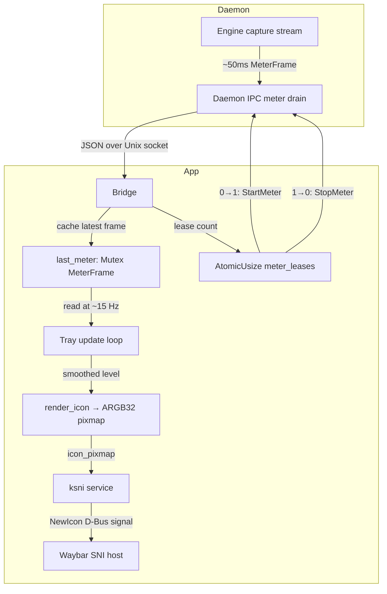

# Tray Level Meter - Plan

**Date:** 2026-08-04
**Status:** Implementation-ready (Product Contract from brainstorm, enriched by ce-plan on 2026-08-04)

---

## Goal Capsule

**Objective:** Add a live audio-level indicator to the antibising system tray icon — when the source is healthy (Linked), the themed icon is replaced by a custom ARGB32 pixmap showing a white microphone silhouette with green fill from the bottom proportional to current input level. Error and degraded states keep their existing themed icons unchanged.

**Product authority:** This plan owns only the tray icon's visual level meter. The existing meter pipeline (engine-side capture, daemon IPC, bridge commands), the panel's own speech indicator, and all non-Linked tray states are not in scope for modification — except where R2's Bridge-side meter lease requires extending `Bridge` to own the subscription lifecycle.

**Authority hierarchy:** Product Contract (R1–R8, scope boundaries) > Planning Contract (KTDs) > per-unit notes. If implementation contradicts a KTD, update the plan; if it contradicts the Product Contract, stop and ask.

**Execution profile:** Live verification against the running PipeWire session and waybar. Render the ARGB32 pixmap to disk for visual inspection; verify tray icon updates by running the app with a real microphone and observing waybar. Unit tests for smoothing math and pixmap rendering (pure functions, no PipeWire needed).

**Stop conditions:**
- Any change that would alter product scope or a closed Key Decision (KD1–KD4).
- D-Bus traffic from throttled pixmap updates measurably degrades waybar responsiveness — stop and reconsider the update rate.

**Open blockers:** None.

---

## Product Contract

### Summary

A glanceable "am I being heard" indicator on the system tray. When the microphone source is healthy, the tray icon renders a white microphone silhouette filled from the bottom with green, proportional to the smoothed audio input level. The fill rises instantly on speech and decays slowly (~300–500ms), so a quick glance during screen-sharing reliably shows whether the mic is picking up sound — even when Google Meet is hidden behind the shared application.

### Problem Frame

During screen-sharing, the shared application covers the Google Meet window, so the browser's own mic indicator is invisible. The only remaining signal that the microphone is working is the system tray icon, which currently shows a static themed icon (`microphone-sensitivity-high-symbolic`) for all healthy states regardless of whether audio is actually flowing. There is no way to confirm at a glance that the mic is picking up speech without switching windows.

### Key Decisions

- KD1. **Pixmap rendering over pre-rendered icon steps.** (session-settled: user-directed — chosen over discrete icon files: continuous fill is smoother and avoids icon-theme installation.) Governs R1, R3.
- KD2. **Always-on meter subscription.** (session-settled: user-directed — chosen over panel-conditional activation: simpler, no panel visibility tracking.) Governs R2.
- KD3. **Green-only fill colour.** (session-settled: user-directed — chosen over green→yellow→red gradient: cleaner, fill height alone communicates level.) Governs R1.
- KD4. **Themed icons for non-Linked states.** (session-settled: user-directed — chosen over custom pixmap for all states: preserves desktop theme's visual language for warnings and errors.) Governs R4.

### Requirements

**Visual behaviour**

- R1. When health is `Linked`, the tray renders a custom ARGB32 pixmap via ksni's `icon_pixmap()`: a white microphone silhouette on a transparent background, with the bottom portion filled green proportional to the current smoothed audio level (0.0 = empty, 1.0 = full).
- R2. The meter stream is always active while the app process is alive, regardless of panel window visibility. Bridge owns the daemon-side meter subscription and caches the latest frame; consumers (tray, webview) read from that shared cache. Bridge sends `StartMeter` when the first consumer needs it and `StopMeter` when none do — a reference-counted lease ensuring the panel's `StopMeter` never silently kills the tray's feed.
- R3. The fill level uses fast-rise/slow-decay smoothing: rises to the current level immediately, decays exponentially with a half-life of approximately 250–300ms (visually responsive) and reaches zero within approximately 2 seconds of sustained silence. The decay is slow enough that a momentary glance during speech always catches a non-empty fill, even between syllables or short pauses.
- R4. Non-Linked states (`Broken`, `Reconnecting`, `SilentNoDevice`, daemon unreachable) continue to use themed icon names via `icon_name()`, unchanged from current behaviour.
- R5. When no meter data has arrived yet but health is `Linked`, the icon renders as the empty (no-fill) microphone silhouette — an honest "no data yet" state, never a false level.

**Update mechanism**

- R6. The ksni `Handle` is retained after spawn (currently dropped) so `handle.update()` can signal pixmap changes to the SNI host.
- R7. Pixmap updates are throttled to approximately 10–15 Hz — sufficient for smooth visual animation, well under the 50ms meter-frame cadence, and within what sway/waybar's event-driven SNI host handles without issue.
- R8. On waybar/swaybar host restart (`watcher_online`), the tray re-announces the current icon state via `handle.update()`, so the level meter resumes without requiring an application restart.

### Key Flows

- F1. Normal speech indication
  - **Trigger:** User speaks into the microphone while health is `Linked`.
  - **Steps:** Engine produces `MeterFrame` at ~50ms cadence → daemon pushes frames to the single Bridge connection → Bridge caches the latest frame → tray's throttled update loop reads the cached frame, applies fast-rise/slow-decay smoothing → `handle.update()` triggers `icon_pixmap()` read → waybar receives `NewIcon` D-Bus signal → tray icon renders with green fill proportional to smoothed level.
  - **Covers R1, R2, R3, R7.**

- F2. Health state transition
  - **Trigger:** Health changes from `Linked` to any other state, or from any other state to `Linked`.
  - **Steps:** On transition away from `Linked`, tray returns an empty `icon_pixmap()` and falls back to themed `icon_name()`. On transition to `Linked`, tray switches to the pixmap path, initially showing the empty microphone silhouette until meter data arrives.
  - **Covers R4, R5.**

### Acceptance Examples

- AE1. Glance during screen-sharing
  - **Covers R1, R3.**
  - **Given:** Health is `Linked`, user is speaking, Google Meet is hidden behind the shared application.
  - **When:** User glances at the system tray.
  - **Then:** The microphone icon shows visible green fill from the bottom. The fill is present even if the glance lands between syllables (slow decay keeps it visible).

- AE2. Silent mic confirmation
  - **Covers R1, R3.**
  - **Given:** Health is `Linked`, user is not speaking, no ambient noise above threshold.
  - **When:** User glances at the system tray.
  - **Then:** The microphone icon shows a white silhouette with no green fill (or minimal residual fill decaying to zero).

- AE3. Device disconnection
  - **Covers R4.**
  - **Given:** Health transitions from `Linked` to `SilentNoDevice` (device unplugged).
  - **When:** User glances at the system tray.
  - **Then:** The icon switches to the themed `microphone-sensitivity-muted-symbolic` icon. No green fill, no custom pixmap.

- AE4. Waybar restart during active speech
  - **Covers R8.**
  - **Given:** Level meter is animating (speech in progress), user restarts waybar.
  - **When:** Waybar comes back up and re-scans SNI items.
  - **Then:** The level meter icon resumes animating within one update cycle (~66ms). No application restart needed.

- AE5. Waybar restart during sustained silence
  - **Covers R8.**
  - **Given:** Health is `Linked`, no audio is flowing (smoothed_level is 0.0 and steady), user restarts waybar.
  - **When:** Waybar comes back up and re-scans SNI items.
  - **Then:** The empty microphone silhouette (white, no green fill) appears in the tray within one update cycle. The icon is not blank/missing — the force-refresh mechanism ensures re-announcement even when the pixmap output is unchanged.

### Scope Boundaries

- Colour changes with volume level (green→yellow→red) — deferred for later.
- Panel-conditional meter subscription (only animate when panel is hidden) — rejected in favour of always-on simplicity.
- Custom pixmap icons for non-Linked states — explicitly out; themed icons are the right choice for error/warning semantics.
- Icon design polish (high-fidelity microphone artwork) — the silhouette is a simple, functional shape; visual refinement is a separate concern if desired later.

### Dependencies / Assumptions

- D1. ksni 0.3.6's `icon_pixmap()` returns `Vec<Icon>` where `Icon { width, height, data }` carries ARGB32 pixels in network byte order (big-endian). Verified against ksni docs.
- D2. Waybar's SNI host is event-driven — it redraws on `NewIcon` D-Bus signals, not polling. `IconPixmap` is supported on sway/waybar per `docs/ksni-tauri-coexistence.md` §5. Verified against waybar's SNI implementation.
- D3. `handle.update()` triggers ksni to emit the `NewIcon` signal. The `Handle` is currently dropped after `tray.spawn()` — retaining it is a small refactor of `app/src/tray.rs:spawn()`.
- D4. The tray and webview share a single Bridge daemon connection. The daemon's meter is per-connection (`meter_slot` in `daemon/src/ipc.rs`), so `StopMeter` from one consumer clears the slot for both. Bridge must own the subscription lifecycle with a reference-counted lease so the tray's always-on need prevents the panel's `StopMeter` from killing the feed.

### Sources / Research

- `docs/ksni-tauri-coexistence.md` §5 — waybar SNI behaviour, `IconPixmap` confirmed working but heavier than `IconName`, icon re-announcement on host restart.
- `engine/src/meter.rs` — `MeterFrame { rms, peak }`, `compute_frame()`, `MeterChannel` bounded drop-oldest queue.
- `app/src/tray.rs` — current `icon_name()` implementation, `Handle` drop rationale, `watcher_online` no-op.
- `app/src/bridge.rs` — `start_meter`/`stop_meter` Tauri commands, `last_health()` cache.

**Product Contract preservation:** R2 and D4 corrected (meter ownership model changed from separate tray subscription to Bridge-owned lease); F1 steps updated to reflect Bridge cache path. No product scope, decisions, or acceptance criteria changed.

---

## Planning Contract

### Key Technical Decisions

- KTD1. **Bridge-owned meter lease with reference counting, plus a live health cache.** Bridge holds an `AtomicUsize` lease count, a cached `MeterFrame` behind a `Mutex`, and a separate `last_health: Mutex<Option<HealthStatus>>` updated by both `Snapshot` and `HealthChanged` events (the existing `last_health()` only extracted from cached snapshots, missing live `HealthChanged` deltas). On disconnect, both `last_meter` and `last_health` are cleared to `None` so no stale `Linked` verdict survives a dead connection. `acquire_meter()` increments the count and sends `StartMeter` if transitioning 0→1; `release_meter()` decrements and sends `StopMeter` if transitioning 1→0. On reconnect, if `meter_leases > 0`, re-sends `StartMeter` to the fresh connection. Governs R2, R4, R5.

- KTD2. **Smoothing in the tray update loop with calibrated RMS scaling.** Bridge caches the raw `MeterFrame`; the tray's ~15 Hz update loop reads `bridge.last_meter()`, scales the raw RMS to a 0.0–1.0 display level using the same ×2 mapping the panel UI uses (`level = min(1.0, rms * 2.0)` — the panel's JS `Math.min(100, Math.round(payload.rms * 200))` means RMS 0.5 = full), then applies fast-rise/slow-decay exponential smoothing (`smoothed = max(level, smoothed * decay_factor)`) and stores the result on `AntibisingTray.smoothed_level`. This keeps Bridge simple (just a cache), localises the smoothing to the only consumer that needs it, and ensures the tray's perception of "full" matches the panel's. Governs R3.

- KTD3. **Procedural microphone silhouette, not an embedded image.** The pixmap is rendered procedurally as a 22×22 ARGB32 buffer: a simple microphone shape (rounded rectangle body + stand arc) drawn with filled pixels. The green fill is a horizontal clip: pixels below `(1.0 - smoothed_level) * height` are green, above are white, background is transparent. No image crate dependency; just a `render_icon(level: f32) -> Vec<u8>` function. Governs R1, KD1.

- KTD4. **Linked state clears `icon_name()`, non-Linked states clear `icon_pixmap()`.** Waybar's SNI host resolves `IconName` first — if it finds a valid theme icon, `IconPixmap` is never consulted. So when Linked, `icon_name()` must return an empty string (forcing waybar to fall through to `icon_pixmap()`), and `icon_pixmap()` returns the rendered meter pixmap. When not Linked, `icon_name()` returns the themed icon name and `icon_pixmap()` returns an empty vec. The two methods are mutually exclusive per health state, not layered. Governs R1, R4, KD4.

- KTD5. **Retain the ksni `Handle` inside the spawn task.** `tray.spawn().await` consumes `AntibisingTray` and returns `Handle<AntibisingTray>`. The existing spawn task currently drops the Handle. The refactored task retains it and enters a `tokio::time::interval` loop calling `handle.update(|tray| { tray.smoothed_level = ...; })` at ~66ms intervals (~15 Hz). `handle.update()` triggers ksni to diff properties and emit `NewIcon` only when the pixmap actually changed. Governs R6, R7.

### High-Level Technical Design

### Assumptions

- A1. ksni's `icon_pixmap()` is called on every D-Bus property read when `handle.update()` has signalled a change. The diff happens inside ksni's service loop (confirmed in `ksni-0.3.6/src/service.rs:253-255`).
- A2. 22×22 is a suitable icon size for waybar's tray area. Waybar scales icons to its configured height; 22px is the de-facto standard for SNI tray icons.
- A3. The exponential decay factor at 15 Hz is approximately `0.85` per tick. Half-life: ~4 ticks ≈ 266ms (within R3's 250–300ms target). From full scale (1.0), the level crosses the 0.01 clamp-to-zero threshold in ~29 ticks ≈ 1.9 seconds (within R3's ~2 second zero-out target).

---

## Implementation Units

### U1. Bridge meter lease and frame cache

- **Goal:** Bridge owns the daemon meter subscription lifecycle, caches the latest `MeterFrame`, and maintains a live health cache updated by both `Snapshot` and `HealthChanged` events — gated on connection state so no stale data survives a disconnect.
- **Requirements:** R2, R4, R5, D4
- **Dependencies:** None
- **Files:**
  - `app/src/bridge.rs` (modify)
  - `app/src/bridge.rs` (tests at bottom of file)
- **Approach:**
  1. Add fields to `Bridge`: `meter_leases: AtomicUsize`, `last_meter: Mutex<Option<engine::MeterFrame>>`, `last_health: Mutex<Option<engine::HealthStatus>>`.
  2. Add `pub fn acquire_meter(&self)` — increment `meter_leases` (relaxed ordering); if old value was 0, call `self.send(&Request::StartMeter)`.
  3. Add `pub fn release_meter(&self)` — decrement `meter_leases`; if new value is 0, call `self.send(&Request::StopMeter)`. Guard against underflow (saturate at 0).
  4. Add `pub fn last_meter(&self) -> Option<MeterFrame>` — read from the cached frame.
  5. Change `pub fn last_health(&self)` to read from the new `last_health` field instead of extracting from the cached snapshot. This ensures `HealthChanged` deltas (which arrive between snapshots) are reflected immediately.
  6. In `run_connection()`:
     - When the parsed event is `Event::Snapshot { health, .. }`: store health in `last_health` (in addition to the existing snapshot cache).
     - When the parsed event is `Event::HealthChanged(health)`: store health in `last_health`.
     - When the parsed event is `Event::MeterFrame(frame)`: store it in `last_meter`. Continue emitting all events via `app.emit()` as well — the panel's JS `listen()` handler already works.
  7. On disconnect (when `run_connection()` exits): clear both `last_meter` and `last_health` to `None`. This prevents the tray from rendering a stale `Linked` pixmap or a stale meter level when the daemon is gone. The existing `last_snapshot` cache stays (the panel uses it for device list recovery on reconnect), but health is gated on connected state via the separate `last_health` field.
  8. On reconnect (after the `Hello`+`Snapshot` handshake completes in `run_connection()`): if `meter_leases.load() > 0`, re-send `StartMeter` to the fresh daemon connection. The daemon's per-connection meter slot starts empty on each new connection; without this, the tray's always-on lease would silently have no meter running after a daemon restart.
  9. Change `start_meter` and `stop_meter` Tauri commands to call `acquire_meter()`/`release_meter()` instead of `send(&Request::StartMeter/StopMeter)` directly.
- **Patterns to follow:** Existing `last_snapshot`/`last_health` cache pattern in `Bridge`. The existing reconnect-handshake logic in `run_connection()` (connected_emitted flag, snapshot cache).
- **Test scenarios:**
  - Covers AE1. `acquire_meter()` on a fresh Bridge increments lease count to 1 and returns Ok.
  - `release_meter()` from count 1 decrements to 0.
  - `release_meter()` from count 0 saturates at 0 (no panic, no underflow).
  - `last_meter()` returns `None` before any frame arrives.
  - After storing a `MeterFrame`, `last_meter()` returns the stored frame.
  - Two `acquire_meter()` calls followed by one `release_meter()` — lease count is 1, no `StopMeter` sent.
  - After disconnect, `last_meter()` returns `None` (stale data cleared).
  - After disconnect, `last_health()` returns `None` (not stale `Linked`).
  - `last_health()` reflects a `HealthChanged` event without requiring a new `Snapshot`.
  - On reconnect with `meter_leases > 0`, `StartMeter` is re-sent to the new connection.
- **Verification:** Unit tests pass. The Tauri commands `start_meter`/`stop_meter` still work from the panel (backward compatible). After daemon restart, tray meter resumes automatically. After disconnect, tray shows themed icon (not stale pixmap).

### U2. Microphone pixmap renderer

- **Goal:** A pure function that renders a 22×22 ARGB32 microphone silhouette with green fill proportional to a given level.
- **Requirements:** R1, R3, KD1, KD3
- **Dependencies:** None (parallel with U1)
- **Files:**
  - `app/src/tray.rs` (add `render_icon` function and `MIC_SIZE` constant)
  - `app/src/tray.rs` (tests)
- **Approach:**
  1. Define `const MIC_SIZE: i32 = 22`.
  2. Implement `fn render_icon(level: f32) -> Vec<u8>` returning `MIC_SIZE * MIC_SIZE * 4` bytes in ARGB32 network byte order (big-endian: A, R, G, B per pixel).
  3. The microphone shape: a rounded rectangle body (roughly 8×12 pixels centred) with a semicircular top cap, a thin stem below, and a small base arc. Pixels inside the shape are white (`0xFF_FF_FF_FF`) above the fill line and green (`0xFF_00_CC_44`) at or below it. Pixels outside the shape are fully transparent (`0x00_00_00_00`).
  4. The fill line is at `y = MIC_SIZE - (level * mic_body_height)`, where `level` is 0.0–1.0 and `mic_body_height` is the pixel height of the microphone body (excluding the stem/base).
  5. No floating-point per-pixel — precompute the fill line as an integer row index.
- **Patterns to follow:** The existing `icon_name()` method's health-state matching for the overall pattern. ksni's `Icon { width, height, data }` struct for the output shape.
- **Test scenarios:**
  - `render_icon(0.0)` produces a buffer of exactly `22 * 22 * 4 = 1936` bytes.
  - `render_icon(0.0)` — no green pixels exist in the output (all shape pixels are white).
  - `render_icon(1.0)` — all shape pixels are green, no white shape pixels.
  - `render_icon(0.5)` — both green and white pixels exist within the shape boundary.
  - Pixels outside the microphone shape are fully transparent (`alpha == 0x00`) at any level.
- **Verification:** Unit tests pass. Optionally: dump a rendered frame to a raw file and inspect with an image viewer to confirm the shape is recognisable.

### U3. Tray update loop with smoothing and Handle retention

- **Goal:** Retain the ksni `Handle`, run a ~15 Hz update loop that reads the Bridge meter cache, applies smoothing, and triggers pixmap updates.
- **Requirements:** R1, R3, R5, R6, R7, R8
- **Dependencies:** U1, U2
- **Files:**
  - `app/src/tray.rs` (modify `AntibisingTray`, `spawn()`, `icon_pixmap()`, `icon_name()`, `watcher_online()`)
- **Approach:**
  1. Add fields to `AntibisingTray`: `smoothed_level: f32`, `refresh_seq: u32`, `force_icon_refresh: Arc<AtomicBool>`. The `Arc<AtomicBool>` is shared between the struct (accessible in `watcher_online(&self)`) and the update loop (which reads it via the `handle.update(|tray| ...)` closure where `tray` is `&mut AntibisingTray`).
  2. Refactor `spawn()`: retain the `Handle` from `tray.spawn().await?`. Enter a `tokio::time::interval(Duration::from_millis(66))` loop (~15 Hz).
  3. Each tick: call `handle.update(|tray| { ... }).await`. Inside the closure:
     - Read `tray.bridge.last_meter()`.
     - If `Some(frame)`: scale the raw RMS to a 0.0–1.0 display level using the same calibration as the panel UI: `level = f32::min(1.0, frame.rms * 2.0)` (the panel's JS uses `Math.min(100, Math.round(payload.rms * 200))`, so RMS 0.5 = 100% = full). Apply fast-rise/slow-decay smoothing on the scaled level: `tray.smoothed_level = f32::max(level, tray.smoothed_level * DECAY_FACTOR)` where `DECAY_FACTOR ≈ 0.85`.
     - If `None`: decay only: `tray.smoothed_level *= DECAY_FACTOR`.
     - Clamp `smoothed_level` to 0.0 below a threshold (~0.01) to avoid rendering noise.
  4. Modify `icon_name(&self) -> String` (per KTD4):
     - If health is `Linked`: return `String::new()` (empty — forces waybar to fall through to `icon_pixmap()`).
     - Otherwise: return the existing themed icon name for that state (unchanged).
  5. Implement `icon_pixmap(&self) -> Vec<ksni::Icon>` (per KTD4):
     - If health is `Linked`: return `vec![Icon { width: MIC_SIZE, height: MIC_SIZE, data: render_icon(self.smoothed_level) }]`.
     - Otherwise: return `vec![]` (empty — waybar uses `icon_name()` instead).
  6. Implement `watcher_online(&self)` force-refresh. `watcher_online` is synchronous (`fn watcher_online(&self)`, not async) and does not have access to the `Handle` — only `&self`. So it cannot call `handle.update()` directly. Instead: `watcher_online()` sets `self.force_icon_refresh.store(true, Relaxed)`. The update loop checks `tray.force_icon_refresh.load(Relaxed)` each tick; when set, it clears the flag and increments `tray.refresh_seq` inside the `handle.update()` closure. `tool_tip()` incorporates `refresh_seq` into the description string. The changed tooltip hash triggers ksni's `new_tool_tip` signal, which causes waybar to re-fetch all properties including `IconPixmap`. Without this, a steady-state level (silence, sustained noise) produces identical pixmap output tick-to-tick, ksni sees no diff, and waybar stays blank after restart.
  7. Call `bridge.acquire_meter()` before entering the update loop — the tray is always-on (R2, KD2).
- **Patterns to follow:** Existing `tauri::async_runtime::spawn` pattern in current `spawn()`. The `handle.update()` pattern from `docs/ksni-tauri-coexistence.md` §4.
- **Test scenarios:**
  - Covers AE1. Smoothing: given RMS 0.5 after silence, scaled level = 1.0, `smoothed_level` rises to 1.0 (full) immediately.
  - Covers AE2. Smoothing: given silence after scaled level 1.0, `smoothed_level` decays below 0.01 within ~29 ticks (~1.9 seconds), consistent with R3's ~2 second zero-out.
  - Half-life: after ~4 ticks of silence from level 1.0, `smoothed_level` is approximately 0.5 (within R3's 250–300ms half-life target).
  - RMS calibration: RMS 0.25 produces scaled level 0.5 (half fill), matching the panel's ×200 mapping.
  - `icon_pixmap()` returns non-empty `Vec<Icon>` when health is `Linked`.
  - `icon_pixmap()` returns empty `Vec` when health is `SilentNoDevice`.
  - `icon_name()` returns empty string when health is `Linked` (forces waybar to use pixmap).
  - Covers AE3. `icon_name()` returns `microphone-sensitivity-muted-symbolic` when health is `SilentNoDevice` (unchanged behaviour).
  - Covers AE5. `watcher_online()` sets `force_icon_refresh` to `true`; the next update tick increments `refresh_seq` and clears the flag, producing a changed tooltip even when smoothed_level is steady.
  - `force_icon_refresh` is `false` after the forced-refresh tick (consumed, not sticky).
- **Verification:** Run the app with a real microphone. Observe waybar tray icon animating green fill during speech and decaying during silence. Verify themed icon still appears on device disconnection. Kill and restart waybar during silence — verify the empty mic silhouette reappears (not blank).

### U4. Integration: panel backward compatibility

- **Goal:** Verify the panel's existing meter UI continues to work with the new Bridge lease model. No panel code changes needed — U1 keeps emitting `MeterFrame` via `app.emit()`, so the panel's JS `listen()` handler works unchanged.
- **Requirements:** R2
- **Dependencies:** U1
- **Files:**
  - `app/index.html` (no changes expected — verification only)
  - `app/src/bridge.rs` (the `start_meter`/`stop_meter` commands, already changed in U1)
- **Approach:**
  1. U1 resolved this: Bridge continues emitting all events (including `MeterFrame`) via `app.emit()` while also caching the latest frame for the tray. The panel's JS `listen(DAEMON_EVENT, ...)` handler and existing `case 'meter_frame':` handler work without modification.
  2. The only change the panel touches: `start_meter`/`stop_meter` Tauri commands now call `acquire_meter()`/`release_meter()` (U1 step 9). From the panel's perspective this is transparent — the commands still accept no arguments and return `Result<(), String>`.
  3. Verify: panel `stop_meter` (via `release_meter()`) decrements the lease count but does not send `StopMeter` to the daemon while the tray's lease is active (lease count stays > 0). The meter stream continues flowing; the panel simply stops reacting to the events it still receives (its existing JS already handles this — the `listen` handler is a no-op when the panel isn't rendering the meter bar).
- **Patterns to follow:** Existing `pull_state` Tauri command pattern for cached data.
- **Test scenarios:**
  - Panel speech indicator still animates when the panel is open and `start_meter` was called.
  - Panel `stop_meter` does not kill the tray meter when the tray is active (lease count > 0).
  - Covers AE4. After waybar restart, tray resumes; panel meter also works after panel re-open.
- **Verification:** Open the panel, verify speech indicator works. Close the panel, verify tray still animates. Re-open the panel, verify speech indicator resumes.

---

## Verification Contract

| Gate | Command / Action | Applies to |
|---|---|---|
| Unit tests | `cargo test -p antibising-app` | U1, U2, U3 |
| Live tray test | Run the app with a real mic; observe waybar icon animating during speech | U3, U4 |
| Panel backward compat | Open panel, verify speech indicator; close panel, verify tray still animates | U4 |
| Waybar restart (active) | Kill and restart waybar while speaking; verify icon resumes animating | U3 |
| Waybar restart (silent) | Kill and restart waybar during silence; verify empty mic silhouette appears (not blank) | U3 |
| Device disconnection | Unplug mic while tray is animating; verify themed muted icon appears | U3 |
| Silence decay | Stop speaking; verify fill decays to empty within ~2 seconds | U3 |

---

## Definition of Done

- All unit tests pass (`cargo test -p antibising-app`).
- The tray icon shows a white microphone with green fill from the bottom when health is `Linked` and audio is flowing.
- The green fill rises immediately on speech and decays to empty within ~2 seconds of sustained silence.
- Non-Linked states show their existing themed icons (muted, warning, refresh) — no regression.
- The panel's speech indicator continues to work independently of the tray meter.
- The panel's `stop_meter` does not kill the tray's meter feed.
- Waybar restart does not break the tray icon — it resumes animating within one update cycle.