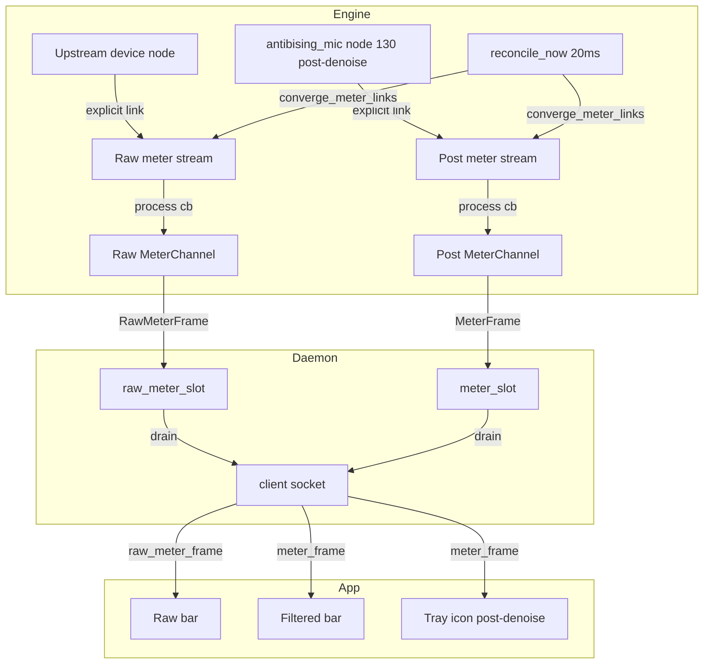

# Dual Denoise Comparison Meter - Plan

**Date:** 2026-08-05
**Status:** Implementation-ready (Product Contract from brainstorm, enriched by ce-plan on 2026-08-05)

---

## Goal Capsule

**Objective:** Give the panel a side-by-side pre-denoise vs post-denoise level comparison for tuning the denoise threshold, and correct the existing meter (which drives both the panel bar and the tray icon) to actually read post-denoise audio — it currently reads the raw microphone.

**Product authority:** This plan owns the meter's audio source correctness and the panel's dual-meter UI. It corrects a latent bug (the meter has always been pre-denoise) and adds a raw comparison meter. The tray icon's visual behaviour (green-fill pixmap, smoothing) is unchanged — only the data feeding it is corrected.

**Authority hierarchy:** Product Contract (R1–R7, scope boundaries) > Planning Contract (KTDs) > per-unit notes. If implementation contradicts a KTD, update the plan; if it contradicts the Product Contract, stop and ask.

**Execution profile:** Engine link-convergence logic (state transitions, dedup) gets ordinary unit tests. The actual PipeWire linking and meter data flow are verified live against the running session with the real filter chain — the method that produced this plan's findings. No audio mocks. **Stop condition:** any test that would disrupt the user's live audio session (SIGKILL on PipeWire, daemon restarts touching the running filter) requires explicit per-run consent.

**Open blockers:** None. The explicit-link lifecycle (former Q1) is resolved — see KTD1.

---

## Product Contract

### Summary

Two stacked horizontal level bars in the panel — labeled "Raw" (pre-denoise) and "Filtered" (post-denoise) — positioned above the threshold slider, so the user can watch both while dragging the slider to find the point where ambient noise disappears from "Filtered" but speech survives. Fixing this also corrects the tray icon, which currently animates on keyboard/non-speech noise because the meter it reads is actually the raw microphone, not the denoised output.

### Problem Frame

The user set out to add a pre-denoise comparison meter and discovered, during investigation, that the *existing* meter is already pre-denoise. The meter stream sets `target.object` to the permanent source's output node (`antibising_mic`, node 130 — post-denoise), but PipeWire links it to the raw microphone device instead. Observed live: the meter stream (`antibisingd`, node 316) has `target.object = 130` yet is linked (link 353) to `alsa_input...Razer_Seiren_Mini` (node 94, the raw device). Consequence: the tray icon animates on keyboard noise because it reflects the raw mic, not what applications actually receive.

For threshold tuning, the user needs to see both signals at once: the raw input (what's coming in) and the filtered output (what survives). Currently there is only one meter, and it shows the wrong (raw) signal.

### Key Decisions

- KD1. **Fix the existing meter to post-denoise; add a new raw meter alongside.** (session-settled: user-directed — hard requirement: both pre- and post-denoise comparison meters AND a post-denoise tray icon.) The existing meter becomes the "Filtered" (post-denoise) source. A second, new meter provides the "Raw" (pre-denoise) source. Governs R1, R2, R5.
- KD2. **Do not modify the `MeterFrame` struct.** `MeterFrame` has CRITICAL blast radius (6 direct callers, 11 processes across engine/daemon/IPC per impact analysis). The dual meter uses a new `Event` variant carrying the same `MeterFrame` type, not a widened struct. Governs R3.
- KD3. **Tray icon stays post-denoise, unchanged visually.** Once the existing meter is corrected to post-denoise, the tray icon automatically shows post-denoise level — no tray code change needed beyond consuming the corrected feed. Governs R5.

### Requirements

**Meter source correctness**

- R1. The "Filtered" meter reads the post-denoise signal — the audio at the permanent source's output (`antibising_mic`, node 130), which is what applications actually receive. This corrects the current behaviour where the meter reads the raw microphone.
- R2. The "Raw" meter reads the pre-denoise signal — the audio from the upstream device currently feeding the filter chain. When the user switches microphones, the raw meter follows the new device.
- R5. The tray icon reads the corrected post-denoise "Filtered" signal. Its visual behaviour (green-fill pixmap, fast-rise/slow-decay smoothing, sqrt scaling) is unchanged — only the underlying data is corrected. After the fix, the tray icon no longer animates on keyboard/non-speech noise (assuming the denoise threshold is filtering it).

**Comparison UI**

- R6. The panel shows two stacked horizontal meter bars, labeled "Raw" and "Filtered", positioned above the threshold slider. Both are visible simultaneously during threshold adjustment.
- R7. When no microphone is connected, both bars remain visible; the "Raw" bar reads empty (no device to capture from). No layout shift.

**Protocol**

- R3. A new IPC event variant carries raw meter frames, distinct from the existing post-denoise `MeterFrame` event. Both reuse the existing `MeterFrame { rms, peak }` type. The existing post-denoise meter event, subscription commands, and per-connection channel are extended or paralleled, not replaced.
- R4. The raw meter subscription follows the same lifecycle discipline as the existing meter: it never survives app exit, and it is torn down and rebuilt when the upstream device changes.

### Key Flows

- F1. Threshold tuning
  - **Trigger:** User opens the panel and drags the threshold slider while making noise (typing, speaking).
  - **Steps:** Engine captures raw device audio → "Raw" bar shows input level including noise. Engine captures post-denoise source audio → "Filtered" bar shows what survives. User drags threshold until "Filtered" goes flat during typing but rises during speech.
  - **Covers R1, R2, R6.**

- F2. Device switch during metering
  - **Trigger:** User switches microphones while both meters are active.
  - **Steps:** Engine's reconciliation detects the device change → tears down the raw meter stream targeting the old device → rebuilds it targeting the new device. Brief data gap → "Raw" bar momentarily empty → resumes. "Filtered" bar is unaffected (targets the fixed source node).
  - **Covers R2, R4, R7.**

### Acceptance Examples

- AE1. Correct source separation
  - **Covers R1, R2.**
  - **Given:** A denoise threshold that suppresses keyboard noise, user typing (not speaking).
  - **When:** User watches both meters.
  - **Then:** The "Raw" bar rises with keyboard noise; the "Filtered" bar stays low/flat. The two bars visibly differ.

- AE2. Tray icon corrected
  - **Covers R5.**
  - **Given:** Denoise is filtering keyboard noise, user typing (not speaking).
  - **When:** User glances at the tray icon.
  - **Then:** The tray icon does NOT fill green from keyboard noise (it now reads post-denoise). It fills only when actual speech passes the filter.

- AE3. No device
  - **Covers R7.**
  - **Given:** No microphone connected.
  - **When:** User views the panel.
  - **Then:** Both bars are visible; "Raw" reads empty; no layout shift.

- AE4. Device switch recovery
  - **Covers R2, R4.**
  - **Given:** Both meters active, user switches from mic A to mic B.
  - **When:** The switch completes.
  - **Then:** The "Raw" bar resumes showing mic B's input within a short window. No app restart needed.

### Scope Boundaries

- Modifying the `MeterFrame` struct — out; CRITICAL blast radius, use a new event variant instead.
- Changing the tray icon's visual design or smoothing — out; only its data source is corrected (via the R1 meter fix).
- Colour/gradient changes to either meter bar — out; both are simple level bars.
- Per-meter independent scaling curves — deferred; start with the same scaling for both so the comparison is apples-to-apples.

### Dependencies / Assumptions

- A1. The current meter reads pre-denoise because PipeWire's `AUTOCONNECT` routing links the meter stream to the default source (the raw device, node 94) rather than the explicitly-targeted `antibising_mic` (node 130), despite `target.object = 130`. Confirmed by live probe: the meter stream's own input port (node 316, `input_MONO`) is linked (link 353) from the raw Razer device (node 94), not from `antibising_mic`'s output port (172). The `node.link-group = filter-chain-1257002-8` on the source node is the most likely reason autoconnect avoids it. The fix (KTD1) sidesteps the cause entirely by not using autoconnect.
- A2. The post-denoise fix uses explicit port-to-port links, confirmed viable by research (see KTD1). `antibising_mic` exposes output port 172 (`capture_MONO`, dir=out); the meter stream exposes input port `input_MONO` (dir=in) after connect. An explicit `Link` between them is indistinguishable to the stream's process callback from an autoconnect link (verified: PipeWire does not expose link origin to the process callback).
- A3. The engine already tracks the upstream device node (`linked_output_node_ids()`, `node_id_for_device()`) and handles device switches in `reconcile_now()` / `converge_capture_links()`. The raw meter's device-switch lifecycle hooks into this existing reconcile flow.
- A4. Both meters reuse the existing `MeterFrame { rms, peak }` type and the `compute_frame()` math unchanged.
- A5. The 20ms reconcile timer fires on every port arrival (dirty flag set in the registry callback). This makes link convergence idempotent across ticks — the same dedup pattern `converge_capture_links()` already uses.

### Outstanding Questions

**Deferred to Implementation** (execution-time details, not blockers):

- Q3. Exact `MeterSession` field names and the `Link` proxy retention shape — resolved when touching the real `StreamRc`/`MonitorSession` code.
- Q4. Whether to reuse one `converge_meter_links()` for both post and raw meters (parameterized by source node) or two separate functions — decide from the code shape during implementation. Both are viable; the parameterized form is preferred if the port-lookup logic is identical.

### Sources / Research

- `engine/src/session.rs:1610-1682` — `start_meter()` current implementation (targets `source_node_id` with AUTOCONNECT).
- `engine/src/session.rs:1488-1592` — `start_monitor()` explicit-link pattern (the reference for A2).
- `engine/src/session.rs:1405-1440` — `converge_capture_links()` device-switch reconciliation (the hook for R4/F2).
- `daemon/src/ipc.rs:194-239` — Request/Event protocol, `meter_slot` per-connection pattern.
- `app/index.html:140-153,202,327-331` — existing speech-meter bar and `meter_frame` event handling.
- Live PipeWire probe (this session): meter stream node 316 `target.object=130` but linked (353) to raw device node 94; `antibising_mic` node 130 has global output port 172.
- `docs/plans/2026-08-04-001-feat-tray-level-meter-plan.md` — the tray level meter plan whose meter feed this corrects.

**Product Contract preservation:** unchanged. Former Outstanding Questions Q1/Q2 were resolved by Phase 1 research (explicit-link lifecycle is viable) and became KTD1/KTD2; A1/A2 were upgraded from "verify during implementation" to confirmed findings. No requirement, scope boundary, or acceptance criterion changed.

---

## Planning Contract

### Key Technical Decisions

- KTD1. **Explicit port-to-port links via a `converge_meter_links()` reconcile path, not autoconnect; session created unconditionally.** (session-settled: user-directed — instantiates KD1's post-denoise requirement.) The meter stream is created without `AUTOCONNECT`. Crucially, the `MeterSession` is created and stored **regardless of whether the source/target node exists yet** — the current `start_meter` early-returns when `source_node_id` is `None` (session.rs:1616-1618), which would lose any subscription that arrives before the filter chain is ready. After `stream.connect()`, a `.state_changed()` listener captures the stream's `node_id` at `Paused` state. A new branch in `handle_global`'s `ObjectType::Port` handler routes the meter stream's own input port into a `meter_input_ports` collection. `converge_meter_links()` — mirroring `converge_capture_links()`, including its wait-for-ports early-return — creates the explicit `Link` from the target source's output ports to the meter stream's input port once both are available, deduped and idempotent across reconcile ticks. Governs R1, R4.
- KTD2. **New `Event::RawMeterFrame(MeterFrame)` variant + `StartRawMeter`/`StopRawMeter` requests; `MeterFrame` struct untouched.** (session-settled: user-directed — instantiates KD2.) The raw meter parallels the existing meter's IPC surface: a second per-connection `raw_meter_slot`, a second `SessionCommand::StartRawMeter`/`StopRawMeter`, a second `SessionEvent::RawMeterFrame`, and a second bridge lease. The existing `MeterFrame { rms, peak }` type is reused verbatim in both event variants. Governs R3.
- KTD3. **The post-denoise meter targets the fixed source node; the raw meter targets the current upstream device node.** The "Filtered" meter links from `source_output_ports` (node 130, fixed). The "Raw" meter links from the upstream device's output ports, resolved via `linked_output_node_ids()` / `node_id_for_device(desired_device_id)`. On device switch, `converge_meter_links()` for the raw meter purges stale links (output node ≠ new device) and creates fresh ones — identical to how `converge_capture_links()` handles the filter's own input. Governs R2, R4.
- KTD4. **Both meters render in the panel as stacked bars sharing the existing meter-bar CSS.** The panel adds a second bar and a wrapping container with labels. Both consume their respective event (`meter_frame` → "Filtered", `raw_meter_frame` → "Raw") and set bar width via the existing `rms * 200` scaling. No new scaling logic. Governs R6, R7.

### High-Level Technical Design

---

## Implementation Units

### U1. Engine: explicit-link meter convergence

- **Goal:** Replace the meter stream's autoconnect with explicit port-to-port linking, so the post-denoise meter actually captures from `antibising_mic` (node 130) instead of the raw device. Create the meter session unconditionally (even before the source node exists) so reconciliation can link it whenever the source and ports arrive.
- **Requirements:** R1, R4 (via KTD1)
- **Dependencies:** None
- **Files:**
  - `engine/src/session.rs` (modify `start_meter`, `handle_global` Port branch, add `converge_meter_links`, extend `MeterSession`)
  - `engine/src/session.rs` (tests)
- **Approach:**
  1. Add `node_id: Option<u32>` and `links: Vec<Link>` to `MeterSession`. Add a general `input_ports_by_node: HashMap<u32, Vec<(u32, String)>>` on `Generation` — recording *every* input port keyed by its owning `node.id`, exactly as `device_output_ports` already does for output ports.
  2. **Decouple session creation from source availability.** `start_meter` must NOT early-return when `source_node_id` is `None` (the current behaviour at session.rs:1616-1618 creates no session, so a `StartMeter` that arrives before the filter source appears is lost forever). Instead: always create the `StreamRc` + `.process()` + `.state_changed()` listeners and store the `MeterSession` unconditionally. The stream's own input port still appears regardless of the target; only the *link* to the source waits for the source node.
  3. In `start_meter`, remove `StreamFlags::AUTOCONNECT` from the `stream.connect()` call. On the `.state_changed()` listener reaching `Paused`, capture `stream.node_id()` into the session and set the dirty flag (so the next reconcile tick runs convergence).
  4. In `handle_global`'s `ObjectType::Port` handler, record **every** `direction == "in"` port into `input_ports_by_node[node.id]` unconditionally — do NOT gate on whether a meter session's `node_id` is known yet. This eliminates the ordering race: the stream's input port can be announced *before* the `.state_changed()` callback sets the session's `node_id`, and gating on a known `node_id` would silently discard it with no re-announcement to recover. Recording unconditionally captures the port whenever it arrives; convergence looks it up later by the session's resolved `node_id`. (Keep the existing `capture_input_ports`/`sink_input_ports` specific branches for their consumers, or derive them from the general map — implementer's call, Q3.)
  5. Add `converge_meter_links(gen, core, link_factory, session_id, source_node_id, source_ports)`: resolve the meter stream's input ports as `input_ports_by_node.get(session.node_id?)`; skip (return, retry next tick) if the session's `node_id` is unset, the port isn't in the map yet, the source node is absent, or the source has no output ports; dedup against already-created links; otherwise create explicit `Link` objects (no autoconnect) from source output ports to the meter input port and retain the proxies in `MeterSession.links` (no `object.linger`, same as monitor).
  6. **Schedule convergence when the command is handled — do not rely on a global event.** `reconcile_now` runs at the top of the timer tick, only when the dirty flag is set, and *before* commands are drained (session.rs:990-1002). A `StartMeter` that arrives after the graph has settled sets no global/remove event, so nothing would mark dirty and convergence would never run. In the `StartMeter`/`StartRawMeter` command handler (session.rs ~1041-1043), after `start_meter` creates the session, set the dirty flag so the next tick's top runs `reconcile_now` → `converge_meter_links`. (Setting the flag rather than calling convergence inline is preferred: the stream's own port isn't available yet at command-handling time, so the first useful convergence is a later tick anyway; the flag guarantees at least one convergence attempt, and port/node arrivals re-mark dirty for subsequent retries.) This mirrors how `SetPin`/`SetPreferenceOrder` (session.rs:1019-1027) explicitly reconcile rather than waiting for a global event.
  7. Call `converge_meter_links` from `reconcile_now` for each active meter session, targeting `source_node_id` (post-denoise). Both the source node appearing (a Node global) and the stream's port appearing (a Port global) set the dirty flag, so convergence re-runs on whichever arrives last — and the command handler's dirty-set guarantees the first attempt even on a settled graph.
- **Test scenarios:**
  - Covers AE1. `converge_meter_links` with source ports and the meter input port recorded creates exactly one link; a second call creates none (dedup).
  - `converge_meter_links` with the session `node_id` unset, the port not yet in `input_ports_by_node`, the source node absent, or empty source ports creates no link and does not panic (early return, retries next tick).
  - **Port-before-node-id ordering:** the input port is recorded in `input_ports_by_node` even when it arrives before the session's `node_id` is set; a later convergence tick (after `node_id` is set) finds it and links. This is the race the unconditional recording fixes.
  - `start_meter` called while `source_node_id` is `None` still creates and stores a `MeterSession`.
  - **Settled-graph scheduling:** `StartMeter` handled after all globals have settled still triggers convergence — the command handler sets the dirty flag, so the next tick runs `reconcile_now` even with no new global event. Without this, the meter would never link on a late subscription.
  - After a `MeterSession` exists and the source node later arrives, a reconcile tick creates the link.
  - Live: after the fix, `pw-dump` shows the meter stream (node 316) linked FROM `antibising_mic` (node 130), not the raw device.
- **Verification:** Unit tests for convergence, delayed-session-creation, and the port-before-node-id ordering pass. Live: run the app (including a cold start where the app beats the filter chain), `pw-dump` confirms the meter stream links from node 130. The tray icon no longer animates on keyboard noise (AE2).

### U2. Engine: raw meter stream + device-switch lifecycle

- **Goal:** Add a second meter stream that captures from the upstream device (pre-denoise), following device switches.
- **Requirements:** R2, R4 (via KTD3)
- **Dependencies:** U1
- **Approach:**
  1. Add `SessionCommand::StartRawMeter(session_id, channel)` / `StopRawMeter(session_id)` and `SessionEvent::RawMeterFrame(MeterFrame)` (reusing `MeterFrame`).
  2. Add a `raw_meter_sessions` map on `Generation` and a `RawMeterSession` struct (stream, listener, node_id, links) mirroring `MeterSession`.
  3. `start_raw_meter`: like `start_meter` (U1), create the stream and store the `RawMeterSession` **unconditionally** — do not early-return when no device is connected. The session must exist so `converge_meter_links` can link it once a device arrives. This is the same delayed-availability rule as U1, applied to the no-device case (R7/AE3): no device simply means convergence finds no target ports yet and waits.
  4. In `reconcile_now`, after computing the desired device, call `converge_meter_links` for the raw meter session targeting the current device node (`node_id_for_device(desired_device_id)` and that node's `device_output_ports`). When no device is desired/connected, convergence finds no target and creates no link (empty bar). On device switch, purge raw meter links whose output node ≠ the new device node (dedup/purge pattern from `converge_capture_links`), then create fresh links.
  5. `stop_raw_meter` drops the `RawMeterSession` (tears down stream + links).
- **Patterns to follow:** U1's `converge_meter_links` (reuse it, parameterized by target node + ports — resolves Q4) and its unconditional-session-creation rule. `converge_capture_links` stale-link purge for the device-switch path.
- **Test scenarios:**
  - Covers AE4. On device switch, raw meter links to the old device are purged and new links to the new device are created (verified via the link state in `RawMeterSession`).
  - Covers AE3. `start_raw_meter` with no device connected still creates and stores a `RawMeterSession`; convergence finds no device output ports and creates no link; the channel receives no frames (empty bar). When a device later arrives, a reconcile tick links it.
  - The raw meter and post meter sessions are independent — stopping one does not affect the other.
  - Live: `pw-dump` shows the raw meter stream linked from the current upstream device node.
- **Verification:** Unit tests pass, including the no-device session-creation case. Live: raw meter shows input level including keyboard noise; switching mics moves the raw meter to the new device within a reconcile tick or two; plugging in a mic after a no-device start begins showing the raw level.

### U3. Daemon IPC: raw meter protocol

- **Goal:** Carry raw meter frames over IPC alongside the existing post-denoise meter, per-connection.
- **Requirements:** R3 (via KTD2)
- **Dependencies:** U2
- **Files:**
  - `daemon/src/ipc.rs` (add `Request::StartRawMeter`/`StopRawMeter`, `Event::RawMeterFrame(engine::MeterFrame)`, `raw_meter_slot`, raw drain path)
  - `daemon/src/ipc.rs` (tests)
- **Approach:**
  1. Add `Request::StartRawMeter` / `StopRawMeter` and `Event::RawMeterFrame(engine::MeterFrame)` variants. The `#[serde(rename_all = "snake_case")]` makes the wire tag `raw_meter_frame`.
  2. Add a second per-connection `raw_meter_slot: Arc<Mutex<Option<Arc<Mutex<engine::MeterChannel>>>>>` alongside `meter_slot`.
  3. In `apply_request`, handle `StartRawMeter`/`StopRawMeter` exactly like the existing meter commands but against `raw_meter_slot` and `SessionCommand::StartRawMeter`/`StopRawMeter`.
  4. Extend the per-connection drain thread to drain the raw channel too (or add a parallel drain), emitting `Event::RawMeterFrame`. On connection drop, release both meter sessions.
- **Patterns to follow:** The existing `StartMeter`/`StopMeter` handling in `apply_request` (ipc.rs ~471-486) and the meter drain thread (ipc.rs ~531-559).
- **Test scenarios:**
  - `Event::RawMeterFrame` round-trips through serde with the `raw_meter_frame` tag (extend the existing every-variant-serializes test).
  - `StartRawMeter` sets the raw meter slot and forwards the session command; `StopRawMeter` clears it.
  - Connection drop releases both the meter and raw-meter sessions.
- **Verification:** Unit tests pass. The existing post-denoise meter path is unchanged (regression check).

### U4. App bridge: raw meter lease + cache

- **Goal:** Bridge subscribes to and caches raw meter frames alongside the existing post-denoise meter, with the same refcounted lease discipline.
- **Requirements:** R3, R4
- **Dependencies:** U3
- **Files:**
  - `app/src/bridge.rs` (add `raw_meter_leases`, `last_raw_meter`, `acquire_raw_meter`/`release_raw_meter`, `last_raw_meter()`, raw event caching + reconnect re-subscribe, `start_raw_meter`/`stop_raw_meter` commands)
  - `app/src/bridge.rs` (tests)
- **Approach:**
  1. Mirror the existing meter lease exactly: `raw_meter_leases: AtomicUsize`, `last_raw_meter: Mutex<Option<MeterFrame>>`, `acquire_raw_meter`/`release_raw_meter` (send `StartRawMeter`/`StopRawMeter` on 0↔1 transitions), `last_raw_meter()`.
  2. In `run_connection`, cache `Event::RawMeterFrame(frame)` into `last_raw_meter`; clear it on disconnect; re-send `StartRawMeter` on reconnect if `raw_meter_leases > 0`.
  3. Add `start_raw_meter`/`stop_raw_meter` Tauri commands calling the lease methods.
- **Patterns to follow:** The existing meter lease in `bridge.rs` (`acquire_meter`/`release_meter`/`last_meter`, the `run_connection` cache + reconnect logic) — this is a direct parallel.
- **Test scenarios:**
  - `acquire_raw_meter` / `release_raw_meter` lease counting mirrors the meter lease tests (increment, saturate at 0, two-acquire-one-release).
  - `last_raw_meter()` returns None initially, the cached frame after one arrives, None after disconnect.
- **Verification:** Unit tests pass. Both meter leases operate independently.

### U5. Panel: stacked dual-meter UI

- **Goal:** Show two labeled stacked bars ("Raw", "Filtered") above the threshold slider, both visible during tuning.
- **Requirements:** R6, R7 (via KTD4)
- **Dependencies:** U4
- **Files:**
  - `app/index.html` (add the second bar + labels + container; subscribe to `raw_meter_frame`; invoke `start_raw_meter` on load)
- **Approach:**
  1. Add a wrapping container above the threshold slider with two rows: each row a label ("Raw" / "Filtered") and a bar reusing the existing `#speech-meter` bar CSS. Relabel the existing bar "Filtered".
  2. Add a `case 'raw_meter_frame':` handler mirroring the existing `meter_frame` handler, targeting the raw bar (`Math.min(100, Math.round(payload.rms * 200))`).
  3. On `DOMContentLoaded`, invoke both `start_meter` and `start_raw_meter` (the panel currently relies on the tray's `acquire_meter`; make the panel's own subscription explicit so both meters are active whenever the panel is open).
  4. When no device is connected, the raw bar simply receives no frames and reads empty — no special handling needed (R7).
- **Patterns to follow:** The existing `#speech-meter` bar markup (index.html ~202) and CSS (~140-153), and the `meter_frame` case handler (~327-331).
- **Test scenarios:** Test expectation: none — pure UI markup + a parallel event handler with no new logic. Verified live: both bars render, animate from their respective sources, and stay visible with no device (empty raw bar).
- **Verification:** Live: open the panel, both bars visible above the slider; typing moves the Raw bar and (with denoise on) leaves Filtered low; unplugging the mic empties the Raw bar with no layout shift.

---

## Verification Contract

| Gate | Command / Action | Applies to |
|---|---|---|
| Engine unit tests | `cargo test -p engine` | U1, U2 |
| Daemon unit tests | `cargo test -p antibisingd` | U3 |
| App unit tests | `cargo test -p app` | U4 |
| Post-denoise link (live) | Run app; `pw-dump` shows meter stream linked from `antibising_mic` (node 130), not raw device | U1 |
| Tray corrected (live) | Type without speaking (denoise on); tray icon stays empty, does not fill green | U1 |
| Source separation (live) | Watch both bars while typing; Raw rises, Filtered stays flat | U1, U2, U5 |
| Device switch (live) | Switch mics; Raw bar follows new device within a tick or two | U2 |
| No device (live) | Unplug mic; Raw bar empties, both bars stay visible, no layout shift | U2, U5 |
| Panel regression (live) | Existing Filtered bar still animates; no regression | U3, U5 |

---

## Definition of Done

- All unit tests pass (`cargo test` across engine, daemon, app).
- Live: the meter stream links from `antibising_mic` (post-denoise), confirmed via `pw-dump`.
- The tray icon reads post-denoise — it no longer fills green from keyboard noise when denoise is active.
- The panel shows two labeled stacked bars ("Raw" above "Filtered") above the threshold slider.
- Typing with denoise on: the Raw bar rises, the Filtered bar stays low — the comparison is visible.
- Switching microphones moves the Raw meter to the new device without an app restart.
- With no microphone: both bars remain visible, the Raw bar reads empty, no layout shift.
- The existing post-denoise meter event, commands, and channel are unchanged in wire shape (the `MeterFrame` struct is untouched).
